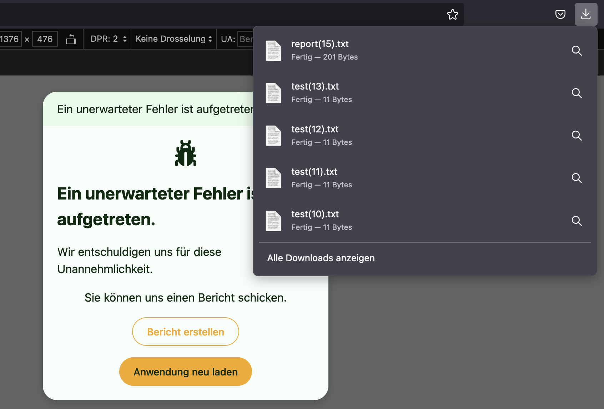

# Download bzw. das Senden von Dateien

Das Backend kann eine oder mehrere Dateien gleichzeitig an eine Frontend-Implementierung senden.
Abhängig von der konkreten Plattform werden die Dateien an das System zur weiteren Verwendung durch den Nutzer weitergereicht.
In einer Webbrowser-Umgebung wird immer genau ein Datei-Download ausgelöst.
Wurden mehrere Dateien gesendet, werden diese vorher in einer Zip-Datei zusammengefasst und als `files.zip` zum Download angeboten.
Auf anderen Plattformen werden in Abhängigkeit der automatisch ermittelten Mimetypes Anwendungen zur Weiterverarbeitung angeboten, z.B. mittels dem `ACTION_SEND_MULTIPLE` Intent unter Android.

Die zum Download angebotenen Dateien sind nur temporär mit einem geheimen Token verfügbar.
Dazu werden die Dateien aus dem `fs.FS` kopiert und an den Lebenszyklus eines _Scopes_ gebunden, d.h. wird der Scope zerstört, wird auch die Datei gelöscht.
Wurde ein Download gestartet und der Scope währenddessen zerstört, kann der laufende Download noch erfolgreich beendet werden.