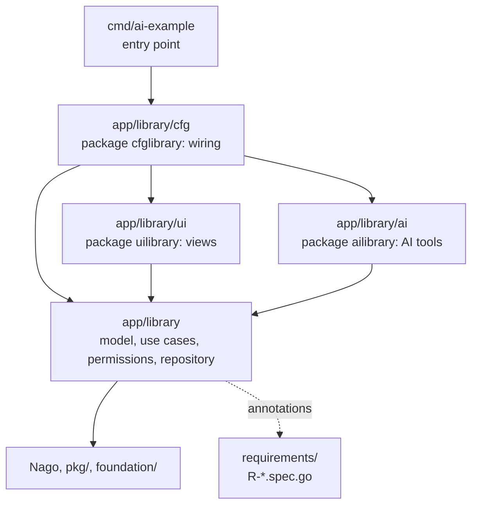

Nago does not force a structure on your code: a tutorial can put everything into one `main.go`. A business
application which is maintained for years needs more. These pages describe the architecture worldiety uses for
Nago applications. It is defined as the profile `go_nago_ddd1` of [speclink](../speclink/), the tool which checks
it, so every project that names this profile follows the same rules and gets the same findings when it breaks
them.

The name has three parts: `go` is the language, `nago` the framework, and `ddd1` the style, a domain-driven design
in three layers with a functional core. You can follow the style without speclink, but only speclink tells you
when you leave it.

## Core ideas

- **The domain says what the system does.** A bounded context under `app/<context>/` holds the model, the use
  cases, the permissions and the repository interfaces. It knows nothing about screens.
- **The user interface is one way to reach the domain.** Views live in `app/<context>/ui/`, an AI tool layer
  may live next to it. Both call use cases; neither touches a repository.
- **Wiring happens in one place.** `app/<context>/cfg/` creates the stores, builds the use cases and registers the
  pages. It is the only package which sees both the domain and its views.
- **A use case is a function with an explicit subject.** `func(auth.Subject, In) (Out, error)`, one per file,
  with its own permission. The caller always has to decide who acts.
- **Persistence is chosen per aggregate.** Repository, event sourcing with decide/evolve, or projections, depending
  on what the requirements ask for. Generic CRUD helpers are not used.
- **Stored data is a promise.** Once a shape is persisted, changing it incompatibly is an error.

## Layers and dependencies

Dependencies point inwards only. The example uses the library context of
[tutorial-113-ai-assistant](/docs/examples/tutorial-113-ai-assistant/), the reference implementation of this
style:

The domain package never imports `ui` or `ai`. A context which imports its own UI cannot be tested without a
renderer, and it cannot get a second way in, e.g. an AI assistant, without changing the domain.


  
  
  
  


## Related

- [speclink](../speclink/): the tool which checks this architecture and links it to the requirements.
- [Use cases and permissions](/docs/concepts/use-cases-and-permissions/) and
  [Persistence](/docs/concepts/persistence/) explain the underlying Nago mechanisms.
