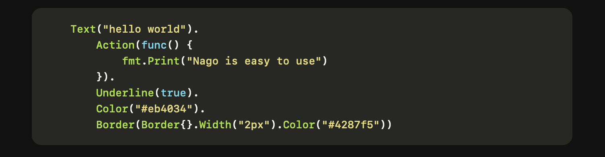

---
# Static content
title: Components
weight: 2
prev: /docs/getting-started
next: /docs/examples
sidebar:
  open: false
---

Components are configured using a fluent builder-style API.  
They support method chaining for layout, style, and behavior customization.

Each method returns a modified version of the component, allowing for chaining.


Be careful with the order as some return types may break the chain.

