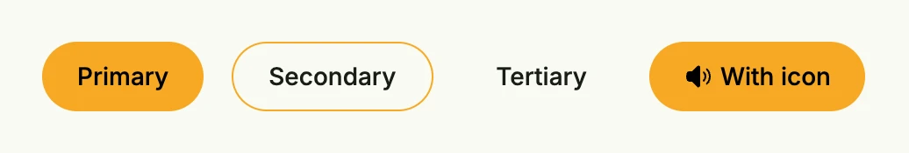

A button triggers an action when the user clicks it. Use `PrimaryButton` for the main action of a view,
`SecondaryButton` for alternatives and `TertiaryButton` for low-emphasis actions like "Cancel" or toolbar
icons. For a button with a custom background color, see [Filled Button](../filled_button/).



```go
HStack(
	PrimaryButton(func() {}).Title("Primary"),
	SecondaryButton(func() {}).Title("Secondary"),
	TertiaryButton(func() {}).Title("Tertiary"),
	PrimaryButton(func() {}).Title("With icon").PreIcon(icons.SpeakerWave),
).Gap(L16)
```

## Constructors

| Constructor | Description |
|---|---|
| `func Button(style ButtonStyle, action func()) TButton` | Creates a button with the given style preset. |
| `func PrimaryButton(action func()) TButton` | Creates a button with the primary preset. |
| `func SecondaryButton(action func()) TButton` | Creates a button with the secondary preset. |
| `func TertiaryButton(action func()) TButton` | Creates a button with the tertiary preset. |

If you only want to navigate, set `HRef` instead of an action. This avoids a render cycle and works with browsers
that block asynchronous navigation, like Safari.

## Methods

| Method | Description |
|---|---|
| `AccessibilityLabel(label string) TButton` | AccessibilityLabel sets a label used by screen readers for accessibility. |
| `Alignment(alignment Alignment) TButton` | Alignment sets the button's content alignment. |
| `Critical(critical bool) TButton` | Switches a primary, secondary or tertiary preset to its critical variant, e.g. for destructive actions. |
| `Disabled(b bool) TButton` | Disables the button, the inverse of `Enabled`. |
| `Enabled(b bool) TButton` | Enabled toggles whether the button is interactive. |
| `Font(font Font) TButton` | Font sets the font style for the button's text label. |
| `Frame(frame Frame) TButton` | Frame sets the layout frame of the button, including size and positioning. |
| `FullWidth() TButton` | Makes the button take the full available width. |
| `HRef(url core.URI) TButton` | HRef sets the URL that the button navigates to when clicked if no action is specified. |
| `ID(id string) TButton` | ID assigns a unique identifier to the button, useful for testing or referencing. |
| `Key(name, id string) TButton` | Key identifies the action across renders by what it acts on, so that a click on a former tree is not lost, see TStack.Key. |
| `NoWrap() TButton` | NoWrap sets a flag to set the button's text to not wrap at white spaces. |
| `PostIcon(svg core.SVG) TButton` | PostIcon sets the icon displayed after the text label. |
| `PreIcon(svg core.SVG) TButton` | PreIcon sets the icon displayed before the text label. |
| `Preset(preset ButtonStyle) TButton` | Preset applies a style preset to the button, controlling its appearance and behavior. |
| `Target(target string) TButton` | Target sets the name of the browsing context, like _self, _blank, _ parent, _top. |
| `Title(text string) TButton` | Title sets the text label displayed on the button. |
| `Visible(b bool) TButton` | Visible controls the visibility of the button; setting false hides it. |

## Related

- [Filled Button](../filled_button/)
- [Text](../text/) for inline links
- Tutorials: [Buttons](/docs/examples/tutorial-11-buttons/), [Custom button](/docs/examples/tutorial-09-custom-button/)
