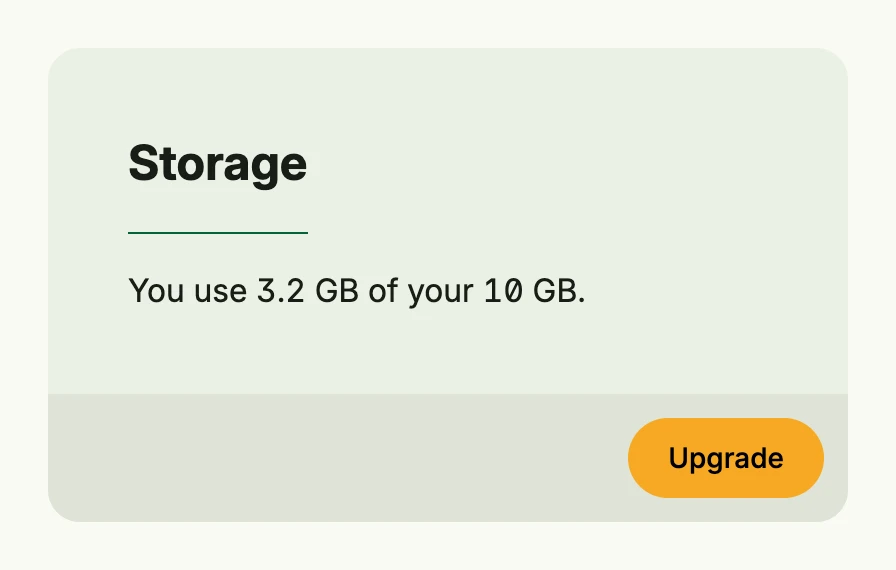

A card groups related content in a visually distinct block with a title, a body and an optional footer, e.g. for
dashboard tiles or settings sections. It lives in package `presentation/ui/cardlayout`; arrange several cards in
a responsive grid with the [Card Layout](/docs/components/layout/card_layout/).



```go
cardlayout.Card("Storage").
	Body(Text("You use 3.2 GB of your 10 GB.")).
	Footer(PrimaryButton(func() {}).Title("Upgrade")).
	Frame(Frame{Width: L400})
```

## Constructors

| Constructor | Description |
|---|---|
| `func Card(title string) TCard` | Creates a card with the given title and default padding. |

## Methods

| Method | Description |
|---|---|
| `Body(view core.View) TCard` | Body defines the main content area of the card. |
| `Footer(view core.View) TCard` | Footer adds a footer view below the card body, typically for actions or secondary info. |
| `Frame(frame ui.Frame) TCard` | Frame sets the layout frame (size and positioning) of the card. |
| `ID(id string) TCard` | ID sets the components unique identifier. |
| `Padding(padding ui.Padding) TCard` | Padding overrides the default padding of the card and marks it as custom. |
| `Style(style TitleStyle) TCard` | Style sets the title style of the card (e.g., heading level or visual variant). |

The title styles are `cardlayout.TitleLarge` (default) and `cardlayout.TitleCompact`.

## Related

- [Card Layout](/docs/components/layout/card_layout/)
- [Colored Text Pill](../colored_text_pill/)
