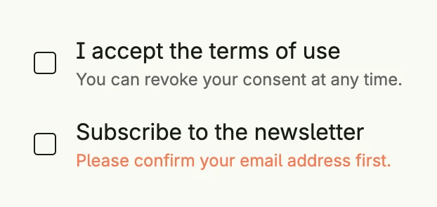

A checkbox field combines a [Checkbox](../checkbox/) with a label, a supporting text and an error text. Use it in
forms. Clicking the label toggles the checkbox.



```go
accepted := core.AutoState[bool](wnd)
newsletter := core.AutoState[bool](wnd)

VStack(
	CheckboxField("I accept the terms of use", accepted.Get()).
		InputValue(accepted).
		SupportingText("You can revoke your consent at any time."),
	CheckboxField("Subscribe to the newsletter", newsletter.Get()).
		InputValue(newsletter).
		ErrorText("Please confirm your email address first."),
).Alignment(Leading).Gap(L16)
```


Without `InputValue` the field renders as a read-only checkmark with its label, and the supporting and error
texts are not shown.


## Constructors

| Constructor | Description |
|---|---|
| `func CheckboxField(label string, value bool) TCheckboxField` | Creates a checkbox field with the given label and value. |

## Methods

Some setters return `DecoredView` instead of `TCheckboxField`. Call them last in the chain.

| Method | Description |
|---|---|
| `AccessibilityLabel(label string) DecoredView` | AccessibilityLabel sets the label used for accessibility purposes. |
| `Border(border Border) DecoredView` | Border sets the border styling of the checkbox field. |
| `Disabled(b bool) TCheckboxField` | Disabled enables or disables user interaction with the checkbox field. |
| `Enabled(b bool) TCheckboxField` | Enabled sets whether the checkbox field is interactive. |
| `ErrorText(text string) TCheckboxField` | ErrorText sets the validation or error message displayed below the field. |
| `Frame(frame Frame) DecoredView` | Frame sets the layout frame of the checkbox field, including size and positioning. |
| `ID(id string) TCheckboxField` | ID assigns a unique identifier to the checkbox field, useful for testing or referencing. |
| `InputValue(inputValue *core.State[bool]) TCheckboxField` | InputValue binds the checkbox field to an external boolean state. |
| `Name(name string) TCheckboxField` | Name assigns a name to the checkbox field, useful for autocomplete. |
| `Padding(padding Padding) DecoredView` | Padding sets the inner spacing around the checkbox field. |
| `SupportingText(text string) TCheckboxField` | SupportingText sets helper or secondary text shown below the label. |
| `Visible(visible bool) DecoredView` | Visible controls the visibility of the checkbox field; setting false hides it. |
| `WithFrame(fn func(Frame) Frame) DecoredView` | WithFrame applies a transformation function to the field's frame and returns the updated component. |

## Related

- [Checkbox](../checkbox/)
- [Toggle Field](/docs/components/composite/toggle_field/)
- [Radio Button Field](../radiobutton_field/)
- Tutorials: [Checkbox](/docs/examples/tutorial-14-checkbox/)
