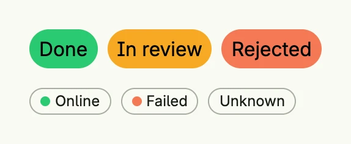

A colored text pill shows a short label on a colored, rounded background, e.g. for tags or categories. It lives
in package `presentation/ui/tags`. The text is always black, so choose light background colors. For status
information prefer `tags.StatusBadge`, which uses the theme text color on a neutral background and shows the
semantic color as a small dot, so that it is readable in light and dark mode.



```go
VStack(
	HStack(
		tags.ColoredTextPill(SG0, "Done"),
		tags.ColoredTextPill(SW0, "In review"),
		tags.ColoredTextPill(SE0, "Rejected"),
	).Gap(L8),
	HStack(
		tags.StatusBadge(SG0, "Online"),
		tags.StatusBadge(SE0, "Failed"),
		tags.StatusBadge("", "Unknown"),
	).Gap(L8),
).Alignment(Leading).Gap(L16)
```

## Constructors

| Constructor | Description |
|---|---|
| `func ColoredTextPill(color ui.Color, text string) TColoredTextPill` | Creates a pill with the given background color and text, with default padding and rounded borders. |
| `func StatusBadge(dot ui.Color, text string) core.View` | Creates a neutral badge with a leading dot in the given color; without a color, no dot is shown. |

## Methods

Most setters return `ui.DecoredView` instead of `TColoredTextPill`.

| Method | Description |
|---|---|
| `AccessibilityLabel(label string) ui.DecoredView` | AccessibilityLabel sets a label used by screen readers for accessibility. |
| `Border(border ui.Border) ui.DecoredView` | Border sets the border style of the pill, such as radius or thickness. |
| `Frame(frame ui.Frame) ui.DecoredView` | Frame sets the layout frame of the pill, including size and alignment. |
| `Padding(padding ui.Padding) ui.DecoredView` | Padding sets the inner spacing around the pill's text. |
| `Visible(visible bool) ui.DecoredView` | Visible controls the visibility of the pill; setting false hides it. |
| `WithFrame(fn func(ui.Frame) ui.Frame) ui.DecoredView` | WithFrame applies a transformation function to the pill's frame and returns the updated component. |

## Related

- [Text](../text/)
- [Card](../card/)
