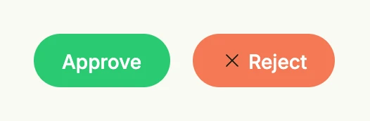

A filled button is a button with a background color of your choice. Use it when the presets of
[Button](../button/) do not fit, e.g. to color-code actions. Prefer the presets for regular actions, because they
follow the theme and support disabled and critical states.



```go
HStack(
	FilledButton(SG0, func() {}).Title("Approve").TextColor(ColorWhite),
	FilledButton(SE0, func() {}).Title("Reject").TextColor(ColorWhite).PreIcon(icons.XMark),
).Gap(L16)
```

## Constructors

| Constructor | Description |
|---|---|
| `func FilledButton(fillColor Color, action func()) TFilledButton` | Creates a filled button with the given background color and action. |

## Methods

| Method | Description |
|---|---|
| `Frame(frame Frame) TFilledButton` | Frame sets the layout frame of the button, including size and positioning. |
| `PostIcon(svg core.SVG) TFilledButton` | PostIcon sets the icon displayed after the text label. |
| `PreIcon(svg core.SVG) TFilledButton` | PreIcon sets the icon displayed before the text label. |
| `TextColor(color Color) TFilledButton` | TextColor sets the text color of the button label. |
| `Title(text string) TFilledButton` | Title sets the text label displayed on the button. |

`TextColor` only applies to the label, the icons keep their default color.

## Related

- [Button](../button/)
- Tutorials: [Colors](/docs/examples/tutorial-08-colors/), [Buttons](/docs/examples/tutorial-11-buttons/)
