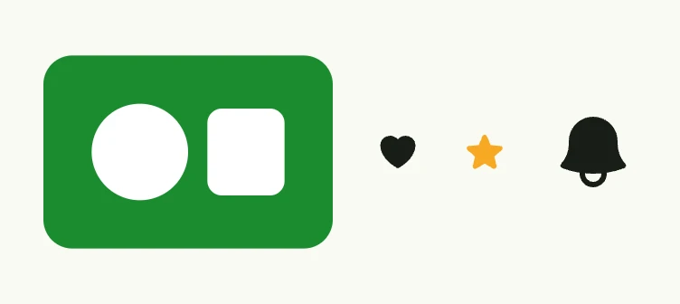

Image shows raster or vector graphics. The source can be an embedded byte slice (small SVGs), an URI (static
resources or external URLs) or an `image.ID` of the image system. `ImageIcon` is a shortcut for icons, e.g. from
`presentation/icons/hero`. Adaptive variants pick a different source for the light and dark theme.



```go
HStack(
	Image().
		Embed([]byte(logo)).
		AccessibilityLabel("A green logo").
		Frame(Frame{}.Size(L160, L120)),
	ImageIcon(icons.Heart),
	ImageIcon(icons.Star).FillColor(SW0),
	ImageIcon(icons.Bell).Frame(Frame{}.Size(L48, L48)),
).Gap(L24)
```

## Constructors

| Constructor | Description |
|---|---|
| `func Image() TImage` | Creates an empty image with a default frame of Auto x L160. |
| `func ImageIcon(svg core.SVG) TImage` | Creates an L24 x L24 icon from an SVG; it is invisible if the SVG is empty. |
| `func ImageIconAdaptive(onLight, onDark core.SVG) TImage` | Like `ImageIcon`, but with an SVG for each theme. |

## Methods

Some setters return `DecoredView` instead of `TImage`. Call them last in the chain.

| Method | Description |
|---|---|
| `AccessibilityLabel(label string) DecoredView` | AccessibilityLabel sets a label for screen readers. |
| `Adaptive(light, dark image.ID) TImage` | Adaptive sets the image to use different sources for light and dark themes. |
| `Border(border Border) DecoredView` | Border sets the border styling of the image. |
| `Embed(buf []byte) TImage` | Embed encodes the given buffer within the components attributes. |
| `EmbedAdaptive(light, dark []byte) TImage` | EmbedAdaptive is like TImage.Embed but picks whatever fits best. |
| `FillColor(color Color) TImage` | FillColor set the internal fill color value and is only applicable for embedded SVG images, which use fill=currentColor. |
| `Frame(frame Frame) DecoredView` | Frame sets the layout frame of the image, including size and positioning. |
| `ObjectFit(fit ObjectFit) TImage` | ObjectFit sets how the image should be resized or scaled inside its frame (e.g., contain, cover, or none). |
| `Padding(padding Padding) DecoredView` | Padding sets the inner spacing around the image. |
| `StrokeColor(color Color) TImage` | StrokeColor set the internal stroke color value and is only applicable for embedded SVG images, which use fill=strokeColor. |
| `URI(uri core.URI) TImage` | URI can be used for static image resources which are not provided by the ui component itself. |
| `URIAdaptive(light, dark core.URI) TImage` | URIAdaptive is like TImage.Embed but picks whatever fits best. |
| `Visible(b bool) DecoredView` | Visible controls the visibility of the image; setting false hides it. |
| `WithFrame(fn func(Frame) Frame) DecoredView` | WithFrame applies a transformation function to the image's frame and returns the updated component. |


Embed only small images, e.g. icons of 1-2 KiB. Serve larger images as a resource (`cfg.Resource`) and set them
with `URI`.


## Related

- [QR Code](../qr_code/)
- Tutorials: [Images](/docs/examples/tutorial-40-images/), [Icons](/docs/examples/tutorial-10-icons/), [SVG](/docs/examples/tutorial-49-svg/)
