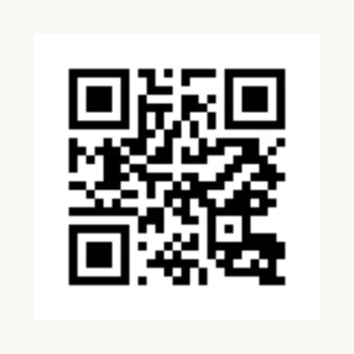

A QR code encodes a string, e.g. a URL, as an image which a phone camera can scan. To scan codes instead, use the
[QR Code Reader](/docs/components/composite/qr_code_reader/).



```go
QrCode("https://www.nago.dev").
	AccessibilityLabel("QR code linking to nago.dev").
	Frame(Frame{}.Size(L200, L200))
```

## Constructors

| Constructor | Description |
|---|---|
| `func QrCode(value string) TQrCode` | Creates a QR code for the given value. |

## Methods

| Method | Description |
|---|---|
| `AccessibilityLabel(label string) TQrCode` | AccessibilityLabel sets a label for screen readers, improving accessibility. |
| `Frame(frame Frame) TQrCode` | Frame sets the layout frame for the QR code. |

## Related

- [Image](../image/)
- Tutorials: [QR code](/docs/examples/tutorial-62-qrcode/)
