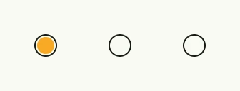

A radio button is one option of a group in which exactly one option is selected. Create the group with
`AutoRadioStateGroup`, which keeps one `*core.State[bool]` per option and clears all others when one is selected,
and bind each radio button to its state. In forms you usually want the [Radio Button Field](../radiobutton_field/),
which adds a label.



```go
group := AutoRadioStateGroup(wnd, "colors", 3).InitIndex(0)

HStack(
	Each2(group.All(), func(idx int, checked *core.State[bool]) core.View {
		return RadioButton(checked.Get()).InputChecked(checked)
	})...,
).Gap(L16)
```

## Constructors

| Constructor | Description |
|---|---|
| `func RadioButton(checked bool) TRadioButton` | Creates a radio button with the given value. |
| `func AutoRadioStateGroup(wnd core.Window, id string, states int) RadioStateGroup` | Creates a window-scoped group of `states` boolean states of which at most one is true. |

## Methods

| Method | Description |
|---|---|
| `Disabled(disabled bool) TRadioButton` | Disabled disables the radio button when set to true, preventing user interaction. |
| `ID(id string) TRadioButton` | Assigns a unique identifier to the radio button. |
| `InputChecked(input *core.State[bool]) TRadioButton` | InputChecked binds the radio button to the given state, enabling two-way data binding so that the selected state is synchronized with external logic. |
| `Name(name string) TRadioButton` | Name defines the name of the checkbox. |
| `Value(checked bool) TRadioButton` | Value sets the initial selected state of the radio button. |
| `Visible(v bool) TRadioButton` | Visible controls the visibility of the radio button. |

### RadioStateGroup

| Method | Description |
|---|---|
| `All() iter.Seq2[int, *core.State[bool]]` | All iterates over all states in the group, yielding (index, state) pairs. |
| `InitIndex(idx int) RadioStateGroup` | InitIndex allows to initialize the radio group with a specific index. |
| `Notify()` | Notify triggers observers of all states in the group. |
| `Observe(f func(newIdx int))` | Observe registers a callback that is invoked with the currently selected index whenever any state in the group changes. |
| `SelectedIndex() int` | SelectedIndex returns -1 or the selected index. |
| `SetSelectedIndex(idx int)` | SetSelectedIndex marks the state at idx as selected (true) and clears all others. |

## Related

- [Radio Button Field](../radiobutton_field/)
- [Select](../select/) for many options
- [Checkbox](../checkbox/)
- Tutorials: [Radio button](/docs/examples/tutorial-15-radiobutton/)
