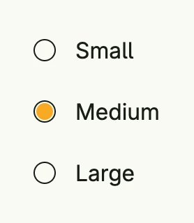

A radio button field combines a [Radio Button](../radio_button/) with a label. It takes the `RadioStateGroup` and
the index of its option, so you do not need to bind the state yourself.



```go
group := AutoRadioStateGroup(wnd, "sizes", 3).InitIndex(1)
labels := []string{"Small", "Medium", "Large"}

VStack(
	Each2(group.All(), func(idx int, checked *core.State[bool]) core.View {
		return RadioButtonField(labels[idx], &group, idx)
	})...,
).Alignment(Leading).Gap(L8)
```

Read the selection with `group.SelectedIndex()` or register a callback with `group.Observe`.

## Constructors

| Constructor | Description |
|---|---|
| `func RadioButtonField(label string, stateGroup *RadioStateGroup, index int) TRadioButtonField` | Creates a labeled radio button for the option at index of the group. |

## Methods

| Method | Description |
|---|---|
| `Disabled(disabled bool) TRadioButtonField` | Disabled disables the radio button when set to true, preventing user interaction. |
| `ID(id string) TRadioButtonField` | Assigns a unique identifier to the field. |
| `InputChecked(input *core.State[bool]) TRadioButtonField` | InputChecked binds the radio button to the given state, enabling two-way data binding so that the selected state is synchronized with external logic. |
| `Label(label string) TRadioButtonField` | Label sets the label of the radio button field. |
| `Name(name string) TRadioButtonField` | Name assigns a name to the checkbox field, useful for autocomplete. |
| `Visible(v bool) TRadioButtonField` | Visible controls the visibility of the radio button. |

## Related

- [Radio Button](../radio_button/) and `RadioStateGroup`
- [Checkbox Field](../checkbox_field/)
- Tutorials: [Radio button](/docs/examples/tutorial-15-radiobutton/)
