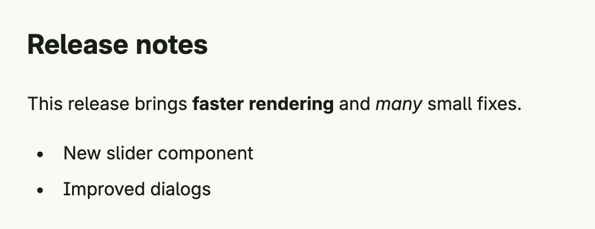

Rich text renders a string of HTML, e.g. content from a CMS or a rich text editor. Use it for formatted
paragraphs, lists and headlines which you do not want to compose from [Text](../text/) views. Only render HTML
from trusted sources. To render Markdown, convert it with `markdown.RichText(value string) ui.TRichText` from
package `presentation/ui/markdown`.



```go
RichText(`<h2>Release notes</h2>
<p>This release brings <b>faster rendering</b> and <i>many</i> small fixes.</p>
<ul>
  <li>New slider component</li>
  <li>Improved dialogs</li>
</ul>`).Frame(Frame{Width: L480})
```

## Constructors

| Constructor | Description |
|---|---|
| `func RichText(value string) TRichText` | Creates a rich text component with the given HTML. |

## Methods

| Method | Description |
|---|---|
| `Frame(frame Frame) TRichText` | Frame sets the layout frame for the rich text component. |
| `FullWidth() TRichText` | FullWidth expands the rich text component to take the full available width. |
| `Value(value string) TRichText` | Value sets the rich text content to be rendered. |

## Related

- [Text](../text/)
- [Rich Text Editor](/docs/components/composite/rich_text_editor/)
- Tutorials: [Rich text](/docs/examples/tutorial-58-richtext/), [Raw HTML](/docs/examples/tutorial-92-raw-html/)
