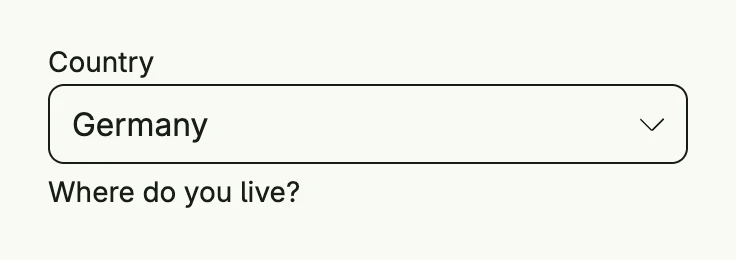

A select lets the user pick exactly one option from a list. It lives in package `presentation/ui/dropdown` and
maps to the native select element of the browser. Enable `StyledDropdown`, `Searchable` or `DropdownInfo` to get
the styled dropdown with search and option descriptions instead. For multiple selection or custom option views,
use the [Picker](/docs/components/composite/picker/).



```go
country := core.AutoState[string](wnd).Init(func() string { return "de" })

dropdown.Dropdown("Country", []dropdown.Option[string]{
	{Value: "de", Label: "Germany"},
	{Value: "fr", Label: "France"},
	{Value: "it", Label: "Italy"},
}, country.Get()).
	InputValue(country).
	SupportingText("Where do you live?").
	Frame(Frame{Width: L320})
```

An `Option[ID]` has a `Value`, a `Label`, a `Description` (only shown in the styled dropdown) and a `Disabled` flag.

## Constructors

| Constructor | Description |
|---|---|
| `func Dropdown[ID ~string](label string, options []Option[ID], value ID) TDropdown[ID]` | Creates a select with the given label, options and selected value. |
| `func FromSlice[T data.Aggregate[ID], ID ~string](label string, values []T, selectedState *core.State[[]T]) TDropdown[ID]` | Creates a select from aggregates with the signature of `picker.Picker`, as a drop-in replacement for single selection. |

## Methods

| Method | Description |
|---|---|
| `Autocomplete(tags string) TDropdown[ID]` | Autocomplete defines the autocomplete tags of the input. |
| `Disabled(disabled bool) TDropdown[ID]` | Disabled enables or disables user interaction with the select. |
| `DropdownInfo(info string) TDropdown[ID]` | DropdownInfo sets an info text to be shown in the styled dropdown. |
| `ErrorText(text string) TDropdown[ID]` | ErrorText sets the error text displayed below the select. |
| `Frame(frame ui.Frame) TDropdown[ID]` | Frame sets the layout frame of the field (size, width, height, etc.). |
| `ID(id string) TDropdown[ID]` | ID assigns a unique identifier to the select, useful for testing or referencing. |
| `InputValue(input *core.State[ID]) TDropdown[ID]` | InputValue binds the select to an external value state, allowing it to be controlled from outside the component. |
| `Label(label string) TDropdown[ID]` | Label sets the label displayed above or inside the select. |
| `Leading(v core.View) TDropdown[ID]` | Leading sets a leading view for the select. |
| `Optional(optional bool) TDropdown[ID]` | Optional sets whether a selection is optional. |
| `Options(options []Option[ID]) TDropdown[ID]` | Options sets the list of options available for selection. |
| `Searchable(b bool) TDropdown[ID]` | Searchable allows the user to filter options in the styled dropdown. |
| `Style(s ui.TextFieldStyle) TDropdown[ID]` | Style sets the visual style of the select. |
| `StyledDropdown(b bool) TDropdown[ID]` | StyledDropdown enables or disables the ORA styled dropdown. |
| `SupportingText(text string) TDropdown[ID]` | SupportingText sets the supporting text displayed below the select. |
| `Value(value ID) TDropdown[ID]` | Value sets the initial value of the select. |

## Related

- [Picker](/docs/components/composite/picker/)
- [Radio Button Field](../radiobutton_field/) for few options
- [Text Field](../text_field/)
- Tutorials: [Select](/docs/examples/tutorial-89-select/)
