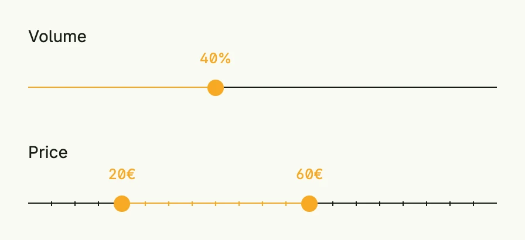

A slider lets the user pick a number within a range by dragging a handle. `RangeSlider` has two handles and
selects an interval, e.g. a price range. Both live in package `presentation/ui/slider` and bind to a state:
`*core.State[float64]` for the slider and `*core.State[slider.RangeSliderValue]` with the fields `From` and `To`
for the range slider.



```go
volume := core.AutoState[float64](wnd).Init(func() float64 { return 40 })
price := core.AutoState[slider.RangeSliderValue](wnd).Init(func() slider.RangeSliderValue {
	return slider.RangeSliderValue{From: 20, To: 60}
})

VStack(
	slider.Slider(0, 100).
		Label("Volume").
		Unit("%").
		InputValue(volume).
		Frame(Frame{Width: L400}),
	slider.RangeSlider(0, 100).
		Label("Price").
		Unit("€").
		Step(5).
		ShowMarkers(true).
		InputValue(price).
		Frame(Frame{Width: L400}),
).Alignment(Leading).Gap(L32)
```

## Constructors

| Constructor | Description |
|---|---|
| `func Slider(min, max float64) TSlider` | Creates a slider with the given range. |
| `func RangeSlider(min, max float64) TRangeSlider` | Creates a range slider with the given range. |

## Methods

`TSlider` and `TRangeSlider` have the same methods; they only differ in the type of the value.

| Method | Description |
|---|---|
| `Disabled(disabled bool) TSlider` | Disabled disables or enables the slider. |
| `ErrorText(text string) TSlider` | ErrorText sets an error message for the slider. |
| `Frame(frame ui.Frame) TSlider` | Frame sets the layout frame of the slider (size, width, height, etc.). |
| `InputValue(input *core.State[float64]) TSlider` | InputValue binds the slider to a reactive state. |
| `Label(label string) TSlider` | Label sets the label text of the slider. |
| `Max(max float64) TSlider` | Max defines the max value of the slider. |
| `Min(min float64) TSlider` | Min defines the min value of the slider. |
| `ShowMarkers(showMarkers bool) TSlider` | ShowMarkers defines whether to show markers on the slider. |
| `Step(step float64) TSlider` | Step defines the step size to increase/decrease number values stepwise. |
| `SupportingText(text string) TSlider` | SupportingText sets helper text for the slider. |
| `Unit(unit string) TSlider` | Unit defines the unit to be displayed next to the value. |
| `Value(value float64) TSlider` | Value sets a static value for the slider. |

For `TRangeSlider`, `InputValue` takes a `*core.State[RangeSliderValue]` and `Value` a `RangeSliderValue`.

## Related

- [Text Field](../text_field/) with `IntField` and `FloatField`
- Tutorials: [Slider](/docs/examples/tutorial-101-slider/)
