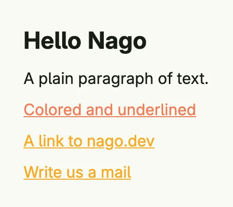

Text displays a string. It is used for headlines, paragraphs, labels and inline links. Set a `Font` for the
typographic role, e.g. `Title`, and a `Color` for emphasis. A text with an `Action` or a link becomes interactive.
For formatted HTML content, use [Rich Text](../rich_text/).



```go
VStack(
	Text("Hello Nago").Font(Title),
	Text("A plain paragraph of text."),
	Text("Colored and underlined").Color(SE0).Underline(true),
	Link(wnd, "A link to nago.dev", "https://www.nago.dev", "_blank"),
	MailTo(wnd, "Write us a mail", "info@example.com"),
).Alignment(Leading).Gap(L8)
```

## Constructors

| Constructor | Description |
|---|---|
| `func Text(content string) TText` | Creates a text with the given content. |
| `func Link(_ core.Window, text string, href string, target string) TText` | Creates a link. An `http` or `https` href opens as usual, other paths navigate inside the app without reloading the page. |
| `func LinkWithAction(text string, action func()) TText` | Creates an underlined, interactive text which calls the action when clicked. |
| `func MailTo(wnd core.Window, name string, email string) TText` | Creates a `mailto:` link which opens the email client of the user. |

## Methods

Some setters return `DecoredView` instead of `TText`. Call them last in the chain or call the `TText` setters first.

| Method | Description |
|---|---|
| `AccessibilityLabel(label string) DecoredView` | AccessibilityLabel sets the label of the text. |
| `Action(f func()) TText` | Action executes the function when the component is clicked. |
| `BackgroundColor(backgroundColor Color) DecoredView` | BackgroundColor sets the color of the background. |
| `Border(border Border) DecoredView` | Border draws a Border around the component. |
| `Color(color Color) TText` | Color sets the Color of the font. |
| `Ellipsis(ellipsis bool) TText` | Ellipsis sets the flag to cut of text overflow with ellipsis. |
| `FocusedBorder(border Border) TText` | FocusedBorder sets the Border width, color and radius when the component is focused. |
| `Font(font Font) TText` | Font sets the size, style and width of the Text. |
| `Frame(frame Frame) DecoredView` | Frame sets the width, minWidth, maxWidth, height, minHeight and maxHeight. |
| `FullWidth() TText` | FullWidth sets the width to 100%. |
| `HoveredBorder(border Border) TText` | HoveredBorder sets the Border width, color and radius when component is hovered. |
| `Hyphens(h Hyphens) TText` | Sets the hyphenation mode, e.g. `HyphensAuto`. |
| `LabelFor(id string) DecoredView` | Makes the text the label of the input element with the given id. |
| `LineBreak(lb bool) TText` | LineBreak de-/activates line breaking in between the Text. |
| `Link(url, target string) TText` | Turns the text into a link to the url, opened in the given browsing context. |
| `Padding(padding Padding) DecoredView` | Padding sets a top, right, bottom and left spacing. |
| `PressedBorder(border Border) TText` | PressedBorder sets the Border width, color and radius when the component is clicked. |
| `Resolve(b bool) TText` | Resolve tries to resolve the current text content against the window bundle at render time to translate its contents. |
| `Text(content string) TText` | Text is a convenience property setter method to set the content for a zero-value Text. |
| `TextAlignment(align TextAlignment) TText` | TextAlignment sets the position of the Text. |
| `Underline(b bool) TText` | Underline underlines the Text. |
| `Visible(visible bool) DecoredView` | Visible decides whether a text is shown. |
| `WhiteSpace(whiteSpace WhiteSpace) TText` | Sets how white space inside the text is handled. |
| `WithFrame(fn func(Frame) Frame) DecoredView` | WithFrame sets width, minWidth, maxWidth, height, minHeight and maxHeight using a function. |
| `WordBreak(wordBreak WordBreak) TText` | Sets where lines may break inside words. |

## Related

- [Rich Text](../rich_text/)
- [Button](../button/)
- Tutorials: [Hello World](/docs/examples/tutorial-01-helloworld/), [Typography](/docs/examples/tutorial-111-typography/), [List](/docs/examples/tutorial-36-list/)
