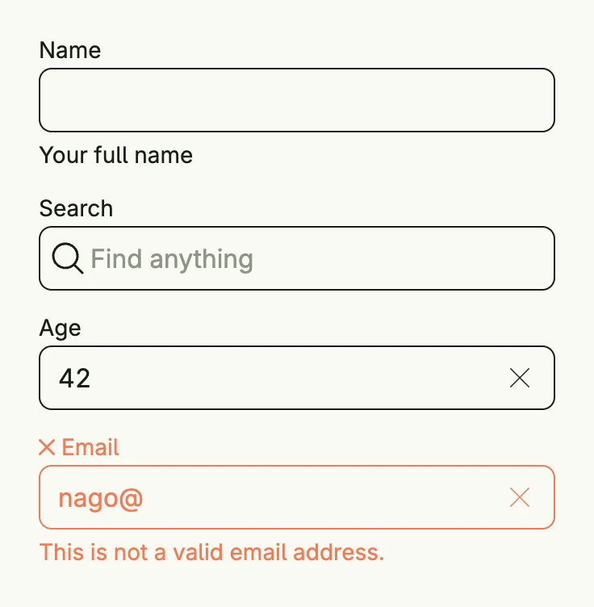

A text field lets the user enter text. It has a label, an optional supporting text, an error text and leading or
trailing views like icons. Bind it to a `*core.State[string]` with `InputValue`; the state is updated while the
user types, debounced by 500ms by default. Set `Lines` for a multi-line text area. `IntField` and `FloatField`
are text fields for numbers which bind to an `int64` or `float64` state.



```go
name := core.AutoState[string](wnd)
age := core.AutoState[int64](wnd).Init(func() int64 { return 42 })

VStack(
	TextField("Name", "").
		InputValue(name).
		SupportingText("Your full name").
		Frame(Frame{Width: L320}),
	TextField("Search", "").
		Leading(ImageIcon(icons.MagnifyingGlass)).
		Placeholder("Find anything").
		Frame(Frame{Width: L320}),
	IntField("Age", age.Get(), age).
		Frame(Frame{Width: L320}),
	TextField("Email", "nago@").
		ErrorText("This is not a valid email address.").
		Frame(Frame{Width: L320}),
).Alignment(Leading).Gap(L16)
```

## Constructors

| Constructor | Description |
|---|---|
| `func TextField(label string, value string) TTextField` | Creates a single-line text field with the given label and initial value. |
| `func IntField(label string, value int64, state *core.State[int64]) TTextField` | Creates a text field for integers bound to the given state. |
| `func FloatField(label string, value float64, state *core.State[float64]) TTextField` | Creates a text field for floats bound to the given state. |
| `func FloatFieldValue[T ~float64 \| ~float32](label string, value T) TTextField` | Creates a text field which only displays a float value without state. |

Keyboard hints for number fields are no guarantee; the user may still type other characters, which are ignored.

## Methods

Some setters return `DecoredView` instead of `TTextField`. Call them last in the chain.

| Method | Description |
|---|---|
| `AccessibilityLabel(label string) DecoredView` | AccessibilityLabel is a placeholder implementation and has no effect yet. |
| `Autocomplete(tags string) TTextField` | Autocomplete defines the autocomplete tags of the input. |
| `Border(border Border) DecoredView` | Border is a placeholder implementation and has no effect yet. |
| `ClearButton(clearButton bool) TTextField` | ClearButton defines whether the text field should show a clear button. |
| `Debounce(enabled bool) TTextField` | Debounce is enabled by default. |
| `DebounceTime(d time.Duration) TTextField` | DebounceTime sets a custom debouncing time when entering text. |
| `Disabled(disabled bool) TTextField` | Disabled disables or enables the field. |
| `ErrorText(text string) TTextField` | ErrorText sets an error message for the field. |
| `Frame(frame Frame) DecoredView` | Frame sets the layout frame of the field (size, width, height, etc.). |
| `FullWidth() TTextField` | FullWidth expands the text field to take the full available width. |
| `ID(id string) TTextField` | ID assigns a unique identifier to the text field. |
| `InputValue(input *core.State[string]) TTextField` | InputValue binds the text field to a reactive state. |
| `KeyboardOptions(options TKeyboardOptions) TTextField` | KeyboardOptions sets advanced keyboard behavior (type, capitalization, return key, etc.). |
| `KeyboardType(keyboardType KeyboardType) TTextField` | KeyboardType sets the type of keyboard to display (e.g., text, number, email). |
| `KeydownEnter(fn func()) TTextField` | KeydownEnter currently only works for one line text fields (lines=0) and not for text area. |
| `Label(label string)` | Label sets the label text of the field. It returns nothing and has no effect, use the constructor instead. |
| `Leading(v core.View) TTextField` | Leading sets a leading view for the field. |
| `Lines(lines int) TTextField` | Lines are by default at 0 and enforces a single line text field. |
| `Max(max float64) TTextField` | Max defines the max value of number fields. |
| `Min(min float64) TTextField` | Min defines the min value of number fields. |
| `Optional(optional bool) TTextField` | Optional defines whether the text field is optional. |
| `Padding(padding Padding) DecoredView` | Padding sets the input field's padding. |
| `Placeholder(placeholder string) TTextField` | Placeholder sets the input's placeholder text. |
| `ShowZero(showZero bool) TTextField` | ShowZero defines wheter the '0' character should be displayed for empty/zero values in number fields. |
| `Step(step int) TTextField` | Step defines the step size to increase/decrease number values stepwise. |
| `Style(s TextFieldStyle) TTextField` | Style sets the wanted style. |
| `SupportingText(text string) TTextField` | SupportingText sets helper text for the field. |
| `TextAlignment(v TextAlignment) TTextField` | Sets the alignment of the entered text. |
| `Trailing(v core.View) TTextField` | Trailing sets a trailing view for the field. |
| `Value(value string) TTextField` | Value sets a static text value for the field. |
| `Visible(v bool) DecoredView` | Visible toggles the visibility of the text field. |
| `WithFrame(fn func(Frame) Frame) DecoredView` | WithFrame updates the current frame of the field via a transformation function. |

## Related

- [Password Field](/docs/components/composite/password_field/)
- [Select](../select/)
- [Slider](../slider/)
- Tutorials: [Text field](/docs/examples/tutorial-12-textfield/), [Multiline text field](/docs/examples/tutorial-84-multiline-textfield/)
