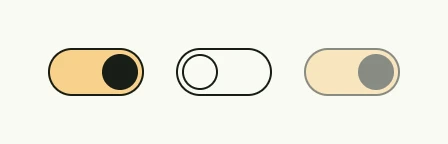

A toggle is a switch for settings which take effect immediately, e.g. enabling notifications. For values which are
submitted later, use a [Checkbox](../checkbox/). The toggle has no label; for a labeled toggle in forms, use the
[Toggle Field](/docs/components/composite/toggle_field/).



```go
enabled := core.AutoState[bool](wnd).Init(func() bool { return true })

HStack(
	Toggle(enabled.Get()).InputChecked(enabled),
	Toggle(false),
	Toggle(true).Disabled(true),
).Gap(L16)
```

## Constructors

| Constructor | Description |
|---|---|
| `func Toggle(checked bool) TToggle` | Creates a toggle with the given value. |

## Methods

| Method | Description |
|---|---|
| `Disabled(disabled bool) TToggle` | Disabled enables or disables interaction with the toggle. |
| `ID(id string) TToggle` | ID sets the ID of the toggle. |
| `InputChecked(input *core.State[bool]) TToggle` | InputChecked binds the toggle to an external boolean state for two-way data binding. |
| `Visible(v bool) TToggle` | Visible controls the visibility of the toggle; false hides it from the UI. |

## Related

- [Toggle Field](/docs/components/composite/toggle_field/)
- [Checkbox](../checkbox/)
- Tutorials: [Toggle](/docs/examples/tutorial-13-toggle/)
