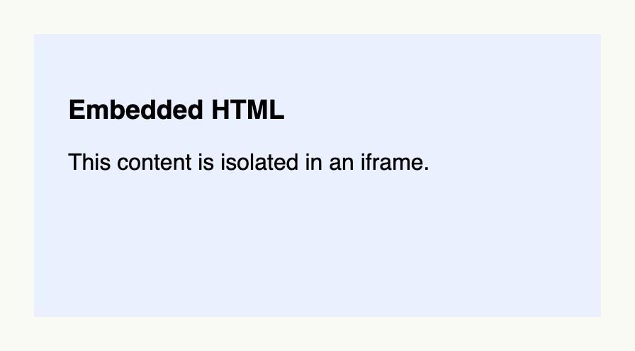

A web view embeds another web page or a piece of raw HTML into your view. The web frontend renders it as an
iframe, so the embedded content is isolated from your application. Use it for third-party widgets like videos or
maps. It lives in package `presentation/ui/webview`.



```go
webview.WebView().
	Title("Embedded page").
	Raw(`<html><body style="font-family: sans-serif; background: #e8f0fe; padding: 16px">
<h3>Embedded HTML</h3>
<p>This content is isolated in an iframe.</p>
</body></html>`).
	Frame(Frame{Width: L400, Height: L200})
```

## Constructors

| Constructor | Description |
|---|---|
| `func WebView() TWebView` | Creates an empty web view; set `Src` or `Raw`. |

## Methods

| Method | Description |
|---|---|
| `Allow(allow string) TWebView` | Sets the permissions policy of the iframe, e.g. `autoplay; fullscreen`. |
| `Frame(frame ui.Frame) TWebView` | Sets the layout frame of the web view. |
| `Raw(raw string) TWebView` | Raw html code which is passed into the frame. |
| `ReferrerPolicy(referrerpolicy string) TWebView` | Sets the referrer policy of the iframe, e.g. `strict-origin-when-cross-origin`. |
| `Src(src core.URI) TWebView` | Sets the URL of the page to embed. |
| `Title(title string) TWebView` | Sets the accessible title of the iframe. |

## Related

- [Video](../video/)
- [PDF](../pdf/)
- [Rich Text](../rich_text/) to render HTML inline
- Tutorials: [WebView](/docs/examples/tutorial-78-webview/)
