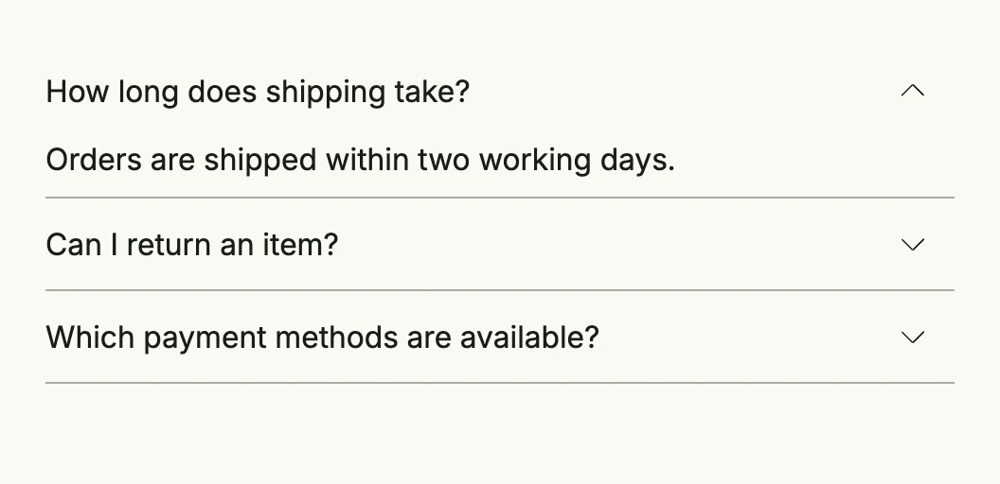

An accordion shows a header which the user clicks to expand or collapse the body below it, e.g. for FAQs or
optional details. It lives in package `presentation/ui/accordion`. Whether it is open is kept in a
`*core.State[bool]`, so you can also open or close it from code.



```go
shipping := core.AutoState[bool](wnd).Init(func() bool { return true })
returns := core.AutoState[bool](wnd)
payment := core.AutoState[bool](wnd)

return VStack(
	accordion.Accordion(
		Text("How long does shipping take?"),
		Text("Orders are shipped within two working days."),
		shipping,
	).FullWidth(),
	accordion.Accordion(
		Text("Can I return an item?"),
		Text("You can return every item within 30 days."),
		returns,
	).FullWidth(),
	accordion.Accordion(
		Text("Which payment methods are available?"),
		Text("Invoice, credit card and direct debit."),
		payment,
	).FullWidth(),
).Frame(Frame{Width: L480})
```

Each accordion is independent; if only one may be open at a time, close the others in an `Observe` of each state.

## Constructors

| Constructor | Description |
|-------------|-------------|
| `func Accordion(header, body core.View, open *core.State[bool]) TAccordion` | Creates an accordion with the given header and body, bound to the open state. |

## Methods

| Method | Description |
|--------|-------------|
| `Frame(frame ui.Frame) TAccordion` | Frame sets the accordions frame to control the accordions bounds. |
| `FullWidth() TAccordion` | FullWidth sets the accordion's frame to full width. |
| `HideSeparator() TAccordion` | HideSeparator sets a flag to hide the bottom border (separator) of the accordion. |
| `InputValue(input *core.State[bool]) TAccordion` | InputValue binds the accordion to an external boolean state, allowing it to be controlled from outside the component. |
| `Small() TAccordion` | Small sets the small flag to enable a smaller visual appearance of the accordion. |

## Related

- [Hover Group](../../layout/hover_group/), [Conditional rendering](../../utility/conditionals/)
- Tutorials: [Accordion](/docs/examples/tutorial-95-accordion/)
