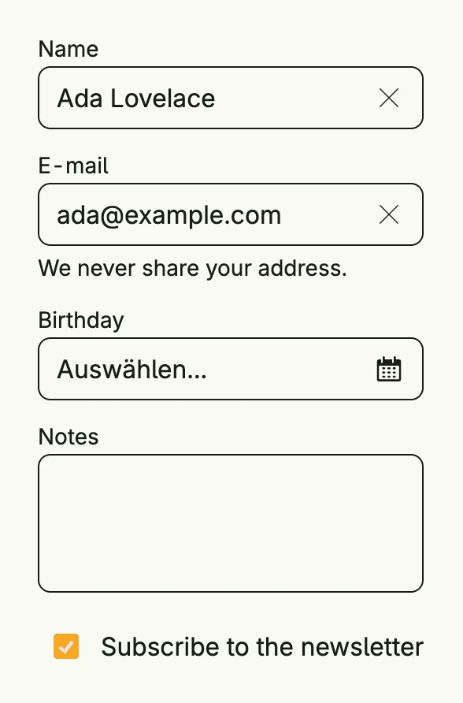

`form.Auto` builds a complete form from a struct by reflection. Each exported field becomes an input
which matches its type, e.g. a text field for a `string`, a toggle for a `bool` or a date picker for an
`xtime.Date`. Struct tags such as `label`, `supportingText`, `lines`, `section`, `style` and `source` control
the rendering. Use it for settings and admin forms where a hand-made layout is not worth the effort.



```go
type contact struct {
    Name       string     `label:"Name"`
    Email      string     `label:"E-mail" supportingText:"We never share your address."`
    Birthday   xtime.Date `label:"Birthday"`
    Notes      string     `label:"Notes" lines:"3"`
    Newsletter bool       `label:"Subscribe to the newsletter"`
}

func view(wnd core.Window) core.View {
    state := core.AutoState[contact](wnd).Init(func() contact {
        return contact{Name: "Ada Lovelace", Email: "ada@example.com", Newsletter: true}
    })

    return form.Auto(form.AutoOptions{Window: wnd}, state).Frame(Frame{Width: L560})
}
```

The form writes every change back into the state. Set `AutoOptions.Errors` to show validation errors at
the matching fields and `AutoOptions.ViewOnly` to render the values read-only.

## Constructors

```go
func Auto[T any](opts AutoOptions, state *core.State[T]) TAuto[T]
```

Auto is similar to [crud.AutoBinding], however it does much less and just creates a form using reflection from the given type.

## Methods

| Method | Description |
|--------|-------------|
| `AccessibilityLabel(label string) ui.DecoredView` | AccessibilityLabel sets the accessibility label for the auto form. |
| `Border(border ui.Border) ui.DecoredView` | Border sets the border styling of the auto form. |
| `CardPadding(padding ui.Padding) TAuto[T]` | CardPadding sets the padding of the section cards. |
| `Frame(frame ui.Frame) ui.DecoredView` | Frame sets the frame of the auto form directly. |
| `FullWidth() TAuto[T]` | FullWidth expands the component to the full available width. |
| `Padding(padding ui.Padding) ui.DecoredView` | Padding sets the padding of the auto form. |
| `Visible(visible bool) ui.DecoredView` | Visible toggles the visibility of the auto form. |
| `WithFrame(fn func(ui.Frame) ui.Frame) ui.DecoredView` | WithFrame updates the frame of the auto form using a transformation function. |

## Related

- [Form](../form/)
- [Multi Steps](../multi_steps/)
- Tutorial [tutorial-48-form-auto](/docs/examples/tutorial-48-form-auto/)
