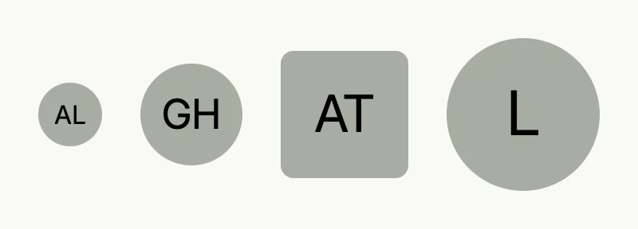

An avatar shows a person or an organization as a small round or rounded image. Without an image, it
shows the initials of the given text. Use it in lists, headers and profile views.



```go
func view(wnd core.Window) core.View {
    return HStack(
        avatar.Text("Ada Lovelace"),
        avatar.Text("Grace Hopper").Size(L64),
        avatar.Text("Alan Turing").Size(L80).Style(avatar.Rounded),
        avatar.Text("Linus").Size(L96).Action(func() {
            // open the profile
        }),
    ).Gap(L24)
}
```

## Constructors

```go
func Embed(data []byte) TAvatar
```

Embed creates an avatar directly from raw image data.

```go
func Text(paraphe string) TAvatar
```

Text creates a text-based avatar using initials derived from the given string.

```go
func TextOrImage(text string, img image.ID) TAvatar
```

TextOrImage creates an avatar from either an image (if provided) or falls back to a text-based avatar.

```go
func URI(uri core.URI) TAvatar
```

URI creates an avatar from a given image URL.

## Methods

| Method | Description |
|--------|-------------|
| `Action(fn func()) TAvatar` | Action sets an optional click action for the avatar. |
| `Border(border ui.Border) TAvatar` | Border sets the border style of the avatar. |
| `Size(widthAndHeight ui.Length) TAvatar` | Size sets the avatar's size and adjusts text size and image resolution accordingly. |
| `Style(style Style) TAvatar` | Style sets the avatar’s border style (circle by default, rounded when specified). |

## Related

- [Avatar Picker](../avatar_picker/)
- [List](../list/)
