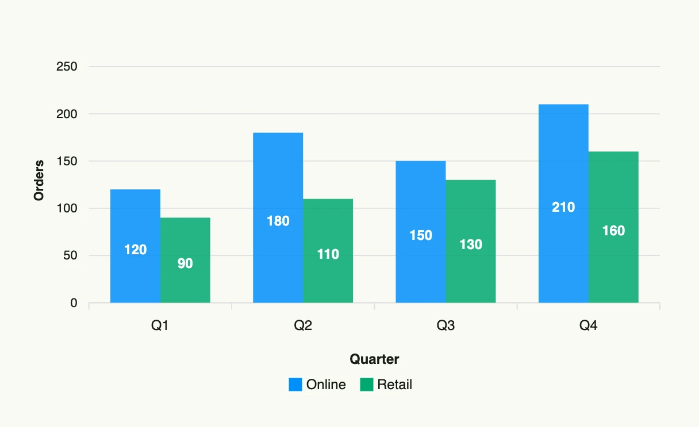

A bar chart compares values across categories. Each `chart.Series` becomes one group of bars, and the
`X` labels of its data points become the categories. Bars can be stacked, laid out horizontally and
annotated with markers.



```go
func view(wnd core.Window) core.View {
    series := []chart.Series{
        {
            Label: "Online",
            DataPoints: []chart.DataPoint{
                {X: "Q1", Y: 120}, {X: "Q2", Y: 180}, {X: "Q3", Y: 150}, {X: "Q4", Y: 210},
            },
        },
        {
            Label: "Retail",
            DataPoints: []chart.DataPoint{
                {X: "Q1", Y: 90}, {X: "Q2", Y: 110}, {X: "Q3", Y: 130}, {X: "Q4", Y: 160},
            },
        },
    }

    return barchart.BarChart(chart.Chart{
        Frame:      Frame{}.Size(L560, L320),
        XAxisTitle: "Quarter",
        YAxisTitle: "Orders",
    }).Series(series)
}
```

## Constructors

```go
func BarChart(chart chart.Chart) TBarChart
```

BarChart creates a new bar chart with default (vertical, non-stacked) configuration.

## Methods

| Method | Description |
|--------|-------------|
| `Chart(chart chart.Chart) TBarChart` | Chart sets the underlying chart configuration for the bar chart. |
| `Horizontal(horizontal bool) TBarChart` | Horizontal sets whether the bar chart is rendered horizontally. |
| `Markers(markers []Marker) TBarChart` | Markers adds markers to the bar chart to highlight values or ranges. |
| `Series(series []chart.Series) TBarChart` | Series defines the data series to be displayed in the bar chart. |
| `Stacked(stacked bool) TBarChart` | Stacked sets whether multiple series are stacked instead of grouped. |

## Related

- [Line Chart](../line_chart/)
- [Pie Chart](../pie_chart/)
- Tutorial [tutorial-65-bar-chart](/docs/examples/tutorial-65-bar-chart/)
