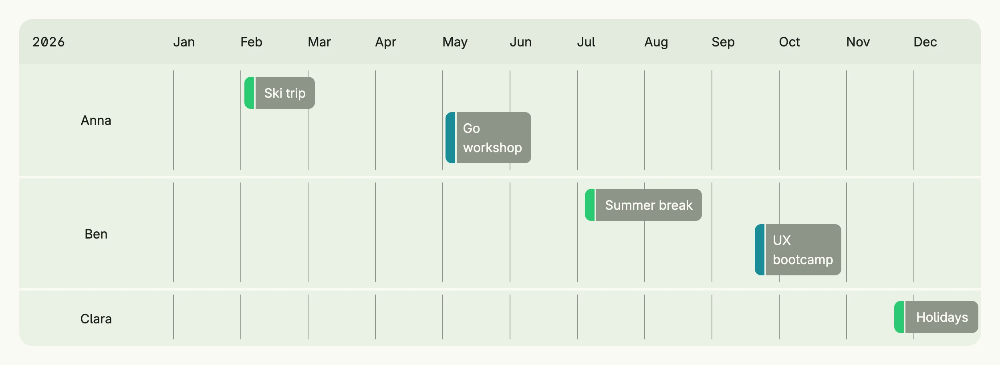

The calendar shows events on a timeline, one lane per resource, e.g. per person or room. The view port
defines the visible range, `calendar.Year` and `calendar.Day` create the common ones. Use the style
`StartTimeSequence` for an agenda-like list instead of the timeline.



```go
func view(wnd core.Window) core.View {
    day := func(month time.Month, d int) calendar.Instant {
        return calendar.Instant{At: time.Date(2026, month, d, 0, 0, 0, 0, time.UTC)}
    }

    vacation := calendar.Category{Label: "Vacation", Color: "#2BCA73"}
    training := calendar.Category{Label: "Training", Color: "#1B8C98"}

    // Year uses German column labels, so set English ones
    year := calendar.Year(2026)
    year.Columns = nil
    for m := time.January; m <= time.December; m++ {
        year.Columns = append(year.Columns, calendar.Column{Label: m.String()[:3]})
    }

    // the timeline styles ignore Frame, so the parent defines the width
    return VStack(calendar.Calendar(
        calendar.Event{From: day(2, 2), To: day(3, 6), Label: "Ski trip", Lane: calendar.Lane{Label: "Anna"}, Categories: []calendar.Category{vacation}},
        calendar.Event{From: day(5, 4), To: day(6, 12), Label: "Go workshop", Lane: calendar.Lane{Label: "Anna"}, Categories: []calendar.Category{training}},
        calendar.Event{From: day(7, 6), To: day(8, 28), Label: "Summer break", Lane: calendar.Lane{Label: "Ben"}, Categories: []calendar.Category{vacation}},
        calendar.Event{From: day(9, 21), To: day(10, 30), Label: "UX bootcamp", Lane: calendar.Lane{Label: "Ben"}, Categories: []calendar.Category{training}},
        calendar.Event{From: day(11, 23), To: day(12, 31), Label: "Holidays", Lane: calendar.Lane{Label: "Clara"}, Categories: []calendar.Category{vacation}},
    ).ViewPort(year).FullWidth()).Frame(Frame{Width: L1200})
}
```

`calendar.Year` uses German month names, so the example sets its own columns. The timeline styles ignore
`Frame`, therefore the parent stack defines the width.

## Constructors

```go
func Calendar(events ...Event) TCalendar
```

Calendar creates a new TCalendar initialized with the current year, a yearly timeline style, and default colors.

## Methods

| Method | Description |
|--------|-------------|
| `Append(events ...Event) TCalendar` | Append adds one or more events to the existing calendar events. |
| `Colors(colors Colors) TCalendar` | Colors customizes the color scheme used for rendering the calendar and its events. |
| `Frame(frame ui.Frame) TCalendar` | Frame defines the layout frame (size, width, height) for the calendar component. |
| `FullWidth() TCalendar` | FullWidth expands the component to the full available width. |
| `MaxCategories(n int) TCalendar` | MaxCategories limits how many category color bars are rendered per event. |
| `Style(style Style) TCalendar` | Style sets the display style (e.g., timeline view) for the calendar. |
| `ViewPort(vp ViewPort) TCalendar` | ViewPort sets the visible time range (e.g., year, month) of the calendar. |

## Related

- [Date Picker](../date_picker/)
- [Time Frame Picker](../time_frame_picker/)
- Tutorial [tutorial-70-calendar](/docs/examples/tutorial-70-calendar/)
