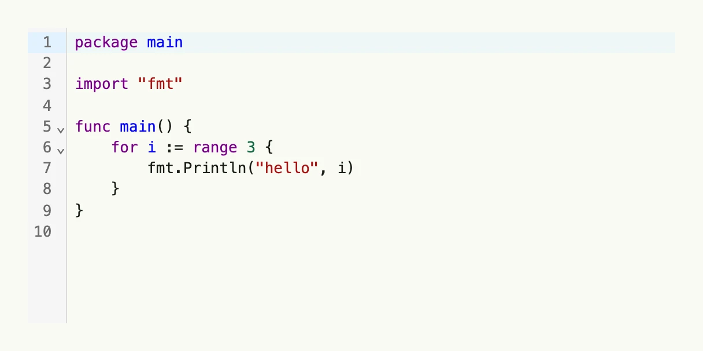

The code editor is a text area with line numbers and syntax highlighting. Use it to let users edit
source code, templates or configuration. `Language` is a hint for the highlighting, e.g. `go`, `json` or
`html`.



```go
const codeSample = `package main

import "fmt"

func main() {
    for i := range 3 {
        fmt.Println("hello", i)
    }
}
`

func view(wnd core.Window) core.View {
    source := core.AutoState[string](wnd).Init(func() string { return codeSample })

    return CodeEditor(source.Get()).
        InputValue(source).
        Language("go").
        Frame(Frame{Width: L560, Height: L256})
}
```

## Constructors

```go
func CodeEditor(value string) TCodeEditor
```

CodeEditor creates a new code editor with the given initial value and a default tab size of 4 spaces.

## Methods

| Method | Description |
|--------|-------------|
| `Disabled(b bool) TCodeEditor` | Disabled enables or disables user interaction with the editor. |
| `Frame(frame Frame) TCodeEditor` | Frame sets the layout frame of the editor, including size and positioning. |
| `FullWidth() TCodeEditor` | FullWidth sets the editor to span the full available width. |
| `InputValue(state *core.State[string]) TCodeEditor` | InputValue binds the editor to an external state for controlled text value updates. |
| `Language(language string) TCodeEditor` | Language gives a syntax highlighting hint. |
| `Value(value string) TCodeEditor` | Value sets the initial text content of the code editor. |

## Related

- [Rich Text Editor](../rich_text_editor/)
- Tutorial [tutorial-54-codeeditor](/docs/examples/tutorial-54-codeeditor/)
