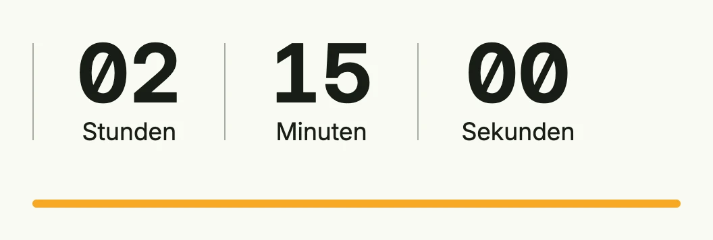

The countdown counts down a duration in the browser, either as a clock (`CountDownStyleClock`) or as a
shrinking progress bar (`CountDownStyleProgress`). When it reaches zero, it invokes the action. Use `Done`
to show it as finished.



```go
func view(wnd core.Window) core.View {
    done := core.AutoState[bool](wnd)

    return VStack(
        CountDown(2*time.Hour+15*time.Minute).
            Style(CountDownStyleClock).
            Days(false),
        CountDown(10*time.Minute).
            Style(CountDownStyleProgress).
            Done(done.Get()).
            Action(func() { done.Set(true) }).
            Frame(Frame{Width: L480}),
    ).Alignment(Leading).Gap(L32)
}
```

## Constructors

```go
func CountDown(duration time.Duration) TCountDown
```

CountDown creates a new countdown timer initialized with the given duration.

## Methods

| Method | Description |
|--------|-------------|
| `Action(action func()) TCountDown` | Action sets the callback function to be executed when the countdown ends. |
| `Days(show bool) TCountDown` | Days toggles whether the countdown displays days. |
| `Done(done bool) TCountDown` | Done marks the countdown as finished, overriding its active state. |
| `Frame(frame Frame) TCountDown` | Frame sets the layout frame of the countdown, including size and positioning. |
| `Hours(show bool) TCountDown` | Hours toggles whether the countdown displays hours. |
| `Minutes(show bool) TCountDown` | Minutes toggles whether the countdown displays minutes. |
| `ProgressBackground(background Color) TCountDown` | ProgressBackground sets the background color of the countdown's progress indicator. |
| `ProgressColor(foreground Color) TCountDown` | ProgressColor sets the foreground color of the countdown's progress indicator. |
| `Seconds(show bool) TCountDown` | Seconds toggles whether the countdown displays seconds. |
| `SeparatorColor(color Color) TCountDown` | SeparatorColor sets the color of separators (e.g., colons) in the countdown display. |
| `Style(style CountDownStyle) TCountDown` | Style sets the visual style of the countdown (e.g., text-only or with progress). |
| `TextColor(color Color) TCountDown` | TextColor sets the color of the countdown text. |

## Related

- [Progress](../progress/)
- Tutorial [tutorial-53-countdown](/docs/examples/tutorial-53-countdown/)
