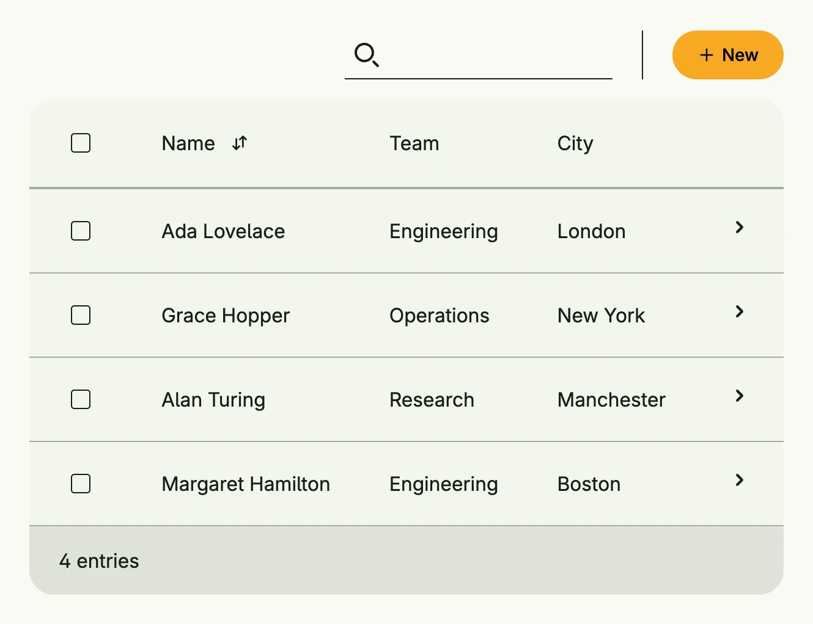

The data view presents a collection as table, cards or list, depending on the window size, and adds
search, sorting, selection and a create button. `FromSlice` works on a plain slice, `FromData` loads the
entries of a repository or use case by ID. It is the standard view for overview pages of entities.



```go
func view(wnd core.Window) core.View {
    type employee struct {
        Name, Team, City string
    }

    employees := []employee{
        {"Ada Lovelace", "Engineering", "London"},
        {"Grace Hopper", "Operations", "New York"},
        {"Alan Turing", "Research", "Manchester"},
        {"Margaret Hamilton", "Engineering", "Boston"},
    }

    type E = dataview.Element[employee]

    return dataview.FromSlice(wnd, employees, []dataview.Field[E]{
        {
            ID:   "name",
            Name: "Name",
            Map:  func(e E) core.View { return Text(e.Value.Name) },
            Comparator: func(a, b E) int {
                return strings.Compare(a.Value.Name, b.Value.Name)
            },
        },
        {
            ID:   "team",
            Name: "Team",
            Map:  func(e E) core.View { return Text(e.Value.Team) },
        },
        {
            ID:   "city",
            Name: "City",
            Map:  func(e E) core.View { return Text(e.Value.City) },
        },
    }).
        Search(true).
        Selection(true).
        CreateAction(func() {
            // open a create dialog
        }).
        Action(func(e E) {
            // open the details of e.Value
        })
}
```

## Constructors

```go
func FromData[E data.Aggregate[ID], ID ~string](wnd core.Window, data Data[E, ID]) TDataView[E, ID]
```

FromData creates a data view which loads its entries by ID, see Data.

```go
func FromModel[E data.Aggregate[ID], ID ~string](wnd core.Window, model pager.Model[E, ID], fields []Field[E]) TDataView[E, ID]
```

FromModel creates a data view from an existing pager model.

```go
func FromSlice[T any](wnd core.Window, slice []T, fields []Field[Element[T]]) TDataView[Element[T], Idx]
```

FromSlice takes the given slice of T and wraps it into an index Element box, so that the identity is based on the index within the slice.

## Methods

| Method | Description |
|--------|-------------|
| `Action(fn func(e E)) TDataView[E, ID]` | Action sets a global listener which is triggered, if an entry has been clicked. |
| `ActionBarContent(content core.View) TDataView[E, ID]` | ActionBarContent allows the user to set some custom content to be shown in the action bar e.g., a short description. |
| `CardOptions(cardOptions CardOptions) TDataView[E, ID]` | CardOptions configures the card style. |
| `CreateAction(fn func()) TDataView[E, ID]` | CreateAction is a conventional default factory to create a new element for this data view. |
| `CreateActionView(view core.View) TDataView[E, ID]` | CreateActionView inserts the given view to idiomatic position for creating new elements. |
| `CreateOptions(actions ...CreateOption) TDataView[E, ID]` | CreateOptions is default factory for [TDataView.NewActionView]. |
| `ListOptions(listOptions ListOptions[ID]) TDataView[E, ID]` | ListOptions configures the list style. |
| `ModelOptions(opts pager.ModelOptions) TDataView[E, ID]` | ModelOptions sets the internal model options used to render directly. |
| `NextActionIndicator(b bool) TDataView[E, ID]` | NextActionIndicator sets a flag if another column should be appended to indicate that an entry has an attached next-action. |
| `Search(visible bool) TDataView[E, ID]` | Search shows or hides the search field. |
| `SelectOptions(options ...SelectOption[ID]) TDataView[E, ID]` | SelectOptions adds a default options button, which is enabled if at least a single item is selected. |
| `Selection(showSelection bool) TDataView[E, ID]` | Selection enabled the flag to show or hide data selection. |
| `SelectionChanged(fn func([]ID)) TDataView[E, ID]` | SelectionChanged sets a callback which is triggered when the selection of this data view has changed. |
| `Style(style Style) TDataView[E, ID]` | Style selects Auto, Table, Card or List; Auto picks by window size. |
| `TableOptions(tableOptions TableOptions) TDataView[E, ID]` | TableOptions configures the table style. |

## Related

- [Table](../table/)
- [List](../list/)
- [Picker](../picker/)
