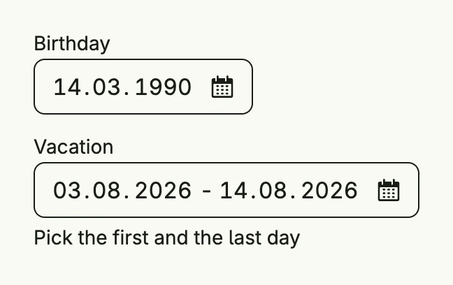

The date picker selects a single day or a range of days as `xtime.Date`, which carries no time zone.
The value is shown in a field, a click opens the calendar.



```go
func view(wnd core.Window) core.View {
    birthday := core.AutoState[xtime.Date](wnd).Init(func() xtime.Date {
        return xtime.Date{Day: 14, Month: 3, Year: 1990}
    })
    start := core.AutoState[xtime.Date](wnd).Init(func() xtime.Date {
        return xtime.Date{Day: 3, Month: 8, Year: 2026}
    })
    end := core.AutoState[xtime.Date](wnd).Init(func() xtime.Date {
        return xtime.Date{Day: 14, Month: 8, Year: 2026}
    })

    return VStack(
        SingleDatePicker("Birthday", birthday.Get(), birthday),
        RangeDatePicker("Vacation", start.Get(), start, end.Get(), end).
            SupportingText("Pick the first and the last day"),
    ).Alignment(Leading).Gap(L16).Frame(Frame{Width: L320})
}
```

## Constructors

```go
func RangeDatePicker(label string, startValue xtime.Date, startInputValue *core.State[xtime.Date], endValue xtime.Date, endInputValue *core.State[xtime.Date]) TDatePicker
```

RangeDatePicker creates a date picker configured for selecting a date range, binding start and end values to their respective states.

```go
func SingleDatePicker(label string, value xtime.Date, inputValue *core.State[xtime.Date]) TDatePicker
```

SingleDatePicker creates a date picker configured for selecting a single date, binding the given value and optional state.

## Methods

| Method | Description |
|--------|-------------|
| `AccessibilityLabel(label string) DecoredView` | AccessibilityLabel sets a label used by screen readers for accessibility. |
| `Border(border Border) DecoredView` | Border sets the border styling of the date picker. |
| `Disabled(disabled bool) TDatePicker` | Disabled enables or disables user interaction with the date picker. |
| `DoubleMode(doubleMode bool) TDatePicker` | DoubleMode enables double-month mode for range pickers. |
| `ErrorText(text string) TDatePicker` | ErrorText sets the validation or error message displayed below the picker. |
| `Frame(frame Frame) DecoredView` | Frame sets the layout frame of the date picker, including size and positioning. |
| `Optional(optional bool) TDatePicker` | Optional sets whether a date selection is optional. |
| `Padding(padding Padding) DecoredView` | Padding sets the inner spacing around the date picker content. |
| `SupportingText(text string) TDatePicker` | SupportingText sets helper or secondary text displayed below the picker label. |
| `Visible(visible bool) DecoredView` | Visible controls the visibility of the date picker; setting false hides it. |
| `WithFrame(fn func(Frame) Frame) DecoredView` | WithFrame applies a transformation function to the picker's frame and returns the updated component. |

## Related

- [Time Picker](../time_picker/)
- [Time Frame Picker](../time_frame_picker/)
- Tutorial [tutorial-16-datepicker](/docs/examples/tutorial-16-datepicker/)
