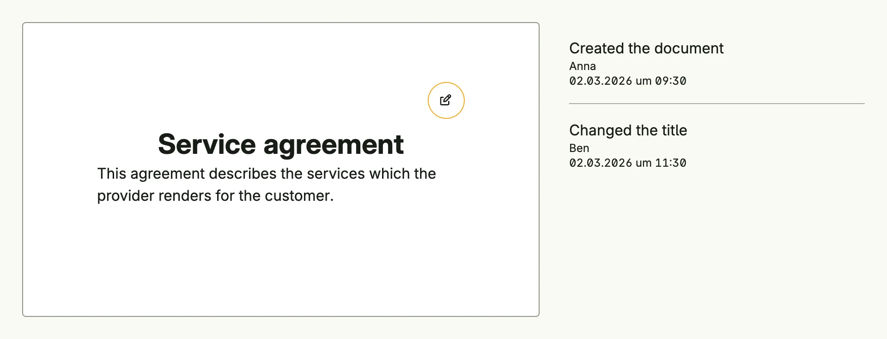

Package `presentation/ui/document` renders content as a sheet of paper with a column of comments next to it,
like a word processor in review mode. `Page` is the sheet, `Editable` switches a part of it between a read and
an edit view, and the comments are log entries or threads of messages. On small windows the page fills the
width and the comments are hidden; they need a large window.



```go
editing := core.AutoState[bool](wnd)
title := core.AutoState[string](wnd).Init(func() string { return "Service agreement" })
when := time.Date(2026, 3, 2, 9, 30, 0, 0, time.UTC)

return document.Page(
	document.Editable(
		func() core.View {
			return Text(title.Get()).Font(HeadlineMedium)
		},
		func() core.View {
			return TextField("Title", title.Get()).InputValue(title)
		},
	).InputValue(editing).FullWidth(),
	Text("This agreement describes the services which the provider renders for the customer."),
).Alignment(TopLeading).
	Size(document.Size{Width: L560, Height: L320}).
	Comment(
		document.LogEntry("Created the document", "Anna", when),
		document.LogEntry("Changed the title", "Ben", when.Add(2*time.Hour)),
	)
```

`Size(document.DinA4)` gives the page the proportions of an A4 sheet. `Thread` shows a discussion with the
names and avatars of the users, so it needs the user management. `AttachComment` marks a view which belongs to a
selected comment, and `NewCommentDialog` asks for the text of a new comment.


`LogEntry` always formats the time in German, e.g. `02.03.2026 um 09:30`.


## Constructors

| Constructor | Description |
|-------------|-------------|
| `func Page(items ...core.View) TPage` | Page creates a kind of virtual endless DinA4 styled paper document. |
| `func Editable(onView func() core.View, onEdit func() core.View) TEditable` | Editable creates a new TEditable with view and edit callbacks. |
| `func LogEntry(message string, who string, when time.Time) TComment` | LogEntry creates a simple TComment displaying a log message, the author (who), and the timestamp (when). |
| `func Thread(wnd core.Window, messages ...Message) TComment` | Thread creates a TComment component that displays a list of messages (a comment thread) along with metadata such as user name, avatar, and timestamp. |
| `func Comment(v core.View) TComment` | Comment wraps an arbitrary core.View as a TComment. |
| `func AttachComment(selection *core.State[bool], v ui.DecoredView) ui.DecoredView` | AttachComment decorates a view with a comment marker if selected. |
| `func NewCommentDialog(presented *core.State[bool], addComment func(text string)) core.View` | Shows a modal dialog which asks for the text of a new comment. |

## Methods

`TPage`:

| Method | Description |
|--------|-------------|
| `Alignment(alignment ui.Alignment) TPage` | Alignment sets how child elements inside the page are aligned (leading, trailing, center, stretch, etc.). |
| `Append(items ...core.View) TPage` | Append adds one or more UI views to the page's main content items. |
| `BackgroundColor(color ui.Color) TPage` | BackgroundColor sets the background color of the page. |
| `Border(border ui.Border) TPage` | Border applies a border style (width, radius, color, etc.) to the page. |
| `Comment(comments ...TComment) TPage` | Comment appends the given comments to any already existing comments. |
| `Frame(frame ui.Frame) TPage` | Frame directly sets the frame (size and layout constraints) of the page. |
| `Size(size Size) TPage` | Size sets the page size to fixed width and height constraints. |

`TEditable`:

| Method | Description |
|--------|-------------|
| `Alignment(alignment ui.Alignment) TEditable` | Alignment sets the alignment of the editable component. |
| `BackgroundColor(color ui.Color) TEditable` | BackgroundColor sets the background color of the editable component. |
| `Border(border ui.Border) TEditable` | Border sets the border of the editable component. |
| `Comment(action func()) TEditable` | Comment sets the callback executed when a comment action is triggered. |
| `Frame(frame ui.Frame) TEditable` | Frame sets the frame (size and layout) of the editable component. |
| `FullWidth() TEditable` | Sets the width to the full available width. |
| `InputValue(editPresented *core.State[bool]) TEditable` | InputValue sets the edit presented state. |
| `Style(style ToggleStyle) TEditable` | Style sets the toggle style of the editable component: `TopTrailing` (default), `InlineTrailing` or `Clickable`. |

`TComment`:

| Method | Description |
|--------|-------------|
| `InputSelectedValue(selected *core.State[bool]) TComment` | InputSelectedValue binds the comment's selected state. |
| `InputValue(comment *core.State[string]) TComment` | InputValue binds the comment's text state. |
| `Resolve(action func()) TComment` | Resolve sets a callback to mark the comment thread as resolved. |

## Related

- [Rich Text Editor](../rich_text_editor/), [Dialog](../../feedback-and-overlay/dialog/)
- Tutorials: [Document](/docs/examples/tutorial-68-document/)
