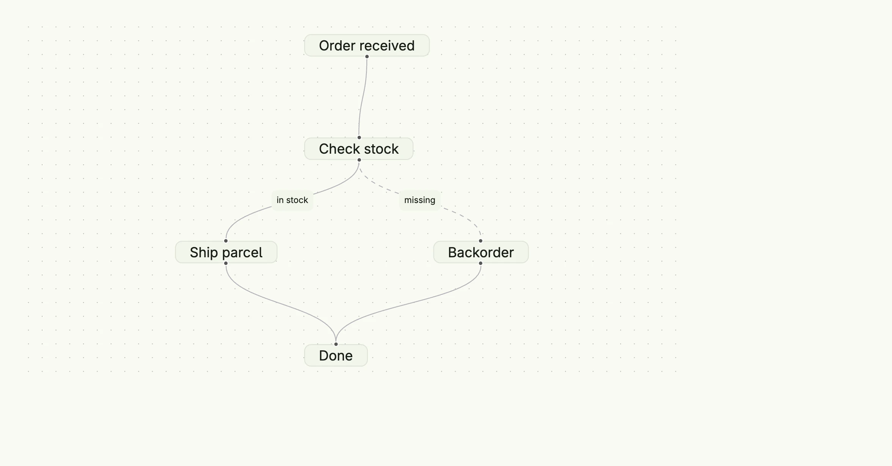

The flow chart draws nodes and connecting edges on a zoomable canvas. Describe the graph as a
`flowchart.Model`, and enable the interactions you need: dragging nodes, connecting them, selecting
elements. Replace the default node rendering with `CustomContents` to show arbitrary views inside the
nodes.



```go
func view(wnd core.Window) core.View {
    model := flowchart.Model{
        Nodes: []flowchart.Node{
            {ID: "order", Label: "Order received", Type: flowchart.NodeTypeStart, Position: flowchart.Point{X: 200, Y: 0}},
            {ID: "check", Label: "Check stock", Position: flowchart.Point{X: 200, Y: 120}},
            {ID: "ship", Label: "Ship parcel", Position: flowchart.Point{X: 50, Y: 240}},
            {ID: "backorder", Label: "Backorder", Position: flowchart.Point{X: 350, Y: 240}},
            {ID: "done", Label: "Done", Type: flowchart.NodeTypeEnd, Position: flowchart.Point{X: 200, Y: 360}},
        },
        Edges: []flowchart.Edge{
            {ID: "e1", SourceNodeID: "order", TargetNodeID: "check"},
            {ID: "e2", SourceNodeID: "check", TargetNodeID: "ship", Label: "in stock"},
            {ID: "e3", SourceNodeID: "check", TargetNodeID: "backorder", Label: "missing", Animated: true},
            {ID: "e4", SourceNodeID: "ship", TargetNodeID: "done"},
            {ID: "e5", SourceNodeID: "backorder", TargetNodeID: "done"},
        },
    }

    return flowchart.FlowChart(model).
        Layout(flowchart.FlowChartLayoutVertical).
        NodesDraggable(true).
        Background(flowchart.Background{GridGap: 16}).
        Frame(Frame{Width: L880, Height: L480})
}
```

Bind a `*core.State[flowchart.Model]` with `InputValue` to keep the positions of dragged nodes, and a
state with `ActionValue` to react to clicks.

## Constructors

```go
func FlowChart(model Model) TFlowChart
```

FlowChart creates a new flowchart component for the given model.

## Methods

| Method | Description |
|--------|-------------|
| `ActionValue(state *core.State[FlowChartActionData]) TFlowChart` | ActionValue binds a state which receives the latest user interaction, e.g. a clicked node or edge. |
| `AppendCustomContent(content CustomContent) TFlowChart` | AppendCustomContent adds a custom view for a node. |
| `AutoLayout(wnd core.Window)` | AutoLayout asks the frontend to arrange all nodes automatically. |
| `Background(background Background) TFlowChart` | Background sets the background color and grid. |
| `CustomContents(contents []CustomContent) TFlowChart` | CustomContents replaces the default node rendering with custom views. |
| `EdgesEditable(val bool) TFlowChart` | EdgesEditable allows the user to change edges. |
| `ElementsSelectable(val bool) TFlowChart` | ElementsSelectable allows the user to select nodes and edges. |
| `Frame(frame ui.Frame) TFlowChart` | Frame sets the layout frame. |
| `FullWidth() TFlowChart` | FullWidth expands the component to the full available width. |
| `InputValue(input *core.State[Model]) TFlowChart` | InputValue binds the flowchart to a stateful model. |
| `Layout(layout FlowChartLayout) TFlowChart` | Layout sets the direction, horizontal or vertical, used to attach edges and for the auto layout. |
| `MaxZoom(maxZoom float64) TFlowChart` | MaxZoom sets the maximum zoom factor. |
| `Menu(menu Menu) TFlowChart` | Menu sets a context menu for the chart. |
| `MinZoom(minZoom float64) TFlowChart` | MinZoom sets the minimum zoom factor. |
| `Model(model Model) TFlowChart` | Model sets the static flowchart model. |
| `Movable(val bool) TFlowChart` | Movable allows the user to pan the chart. |
| `NodesConnectable(val bool) TFlowChart` | NodesConnectable allows the user to connect nodes. |
| `NodesDraggable(val bool) TFlowChart` | NodesDraggable allows the user to move nodes. |
| `ReadOnly(val bool) TFlowChart` | ReadOnly disables all user modifications. |
| `Toolbar(toolbar Toolbar) TFlowChart` | Toolbar configures the toolbar and its actions. |
| `WithFrame(fn func(ui.Frame) ui.Frame) TFlowChart` | WithFrame transforms the current frame with the given function. |

## Related

- [Tree View](../tree_view/)
- Tutorial [tutorial-98-flow-chart](/docs/examples/tutorial-98-flow-chart/)
