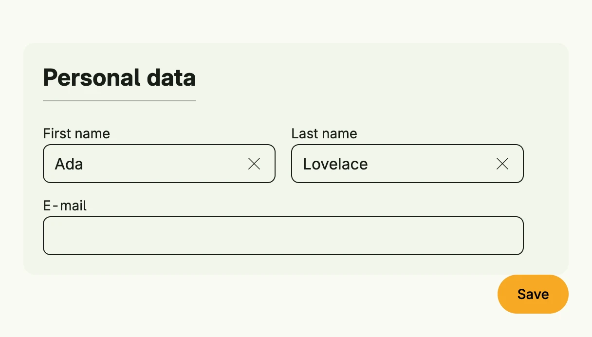

`Form` groups input fields into an HTML form. It enables the browser's autocomplete and submits with
the Enter key, which calls the action. Use `form.Fieldset` to group related fields under a title.



```go
func view(wnd core.Window) core.View {
    firstName := core.AutoState[string](wnd).Init(func() string { return "Ada" })
    lastName := core.AutoState[string](wnd).Init(func() string { return "Lovelace" })
    email := core.AutoState[string](wnd)

    submit := func() {
        // validate and save the input
    }

    return Form(
        form.Fieldset(
            VStack(
                HStack(
                    TextField("First name", firstName.Get()).InputValue(firstName),
                    TextField("Last name", lastName.Get()).InputValue(lastName),
                ).Gap(L16),
                TextField("E-mail", email.Get()).InputValue(email).FullWidth(),
            ).Gap(L16).Alignment(Leading),
        ).Title("Personal data"),
        HStack(PrimaryButton(submit).Title("Save")).Alignment(Trailing).FullWidth(),
    ).Action(submit).Autocomplete(true).Frame(Frame{Width: L560})
}
```

## Constructors

```go
func Form(children ...core.View) TForm
```

Form creates a new form containing the given child views.

## Methods

| Method | Description |
|--------|-------------|
| `Action(action func()) TForm` | Action sets the callback function to be executed when the form is submitted. |
| `Autocomplete(b bool) TForm` | Autocomplete enables or disables browser autocomplete for the form. |
| `Frame(frame Frame) TForm` | Frame sets the layout frame of the form, including size and positioning. |
| `ID(id string) TForm` | ID assigns a unique identifier to the form. |

## Related

- [Auto Form](../auto_form/)
- [Multi Steps](../multi_steps/)
- [Text Field](../../basic/text_field/)
- Tutorial [tutorial-112-form](/docs/examples/tutorial-112-form/)
