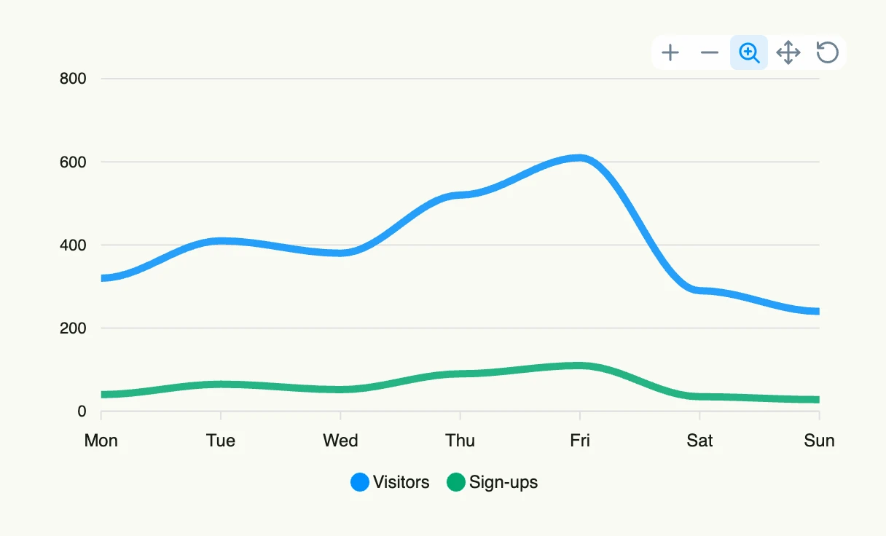

A line chart shows how values develop, typically over time. Each `chart.Series` becomes one line, the
`X` labels of the data points form the x-axis. The curve can be straight, smooth or a step line.



```go
func view(wnd core.Window) core.View {
    series := []chart.Series{
        {
            Label: "Visitors",
            DataPoints: []chart.DataPoint{
                {X: "Mon", Y: 320}, {X: "Tue", Y: 410}, {X: "Wed", Y: 380},
                {X: "Thu", Y: 520}, {X: "Fri", Y: 610}, {X: "Sat", Y: 290}, {X: "Sun", Y: 240},
            },
        },
        {
            Label: "Sign-ups",
            DataPoints: []chart.DataPoint{
                {X: "Mon", Y: 40}, {X: "Tue", Y: 65}, {X: "Wed", Y: 52},
                {X: "Thu", Y: 90}, {X: "Fri", Y: 110}, {X: "Sat", Y: 35}, {X: "Sun", Y: 28},
            },
        },
    }

    return linechart.LineChart(chart.Chart{
        Frame: Frame{}.Size(L560, L320),
    }).Series(series).Curve(linechart.CurveSmooth)
}
```

## Constructors

```go
func LineChart(chart chart.Chart) TLineChart
```

LineChart returns a TLineChart initialized with the given chart.

## Methods

| Method | Description |
|--------|-------------|
| `Chart(chart chart.Chart) TLineChart` | Chart sets the chart config. |
| `Curve(curve Curve) TLineChart` | Curve sets the curve style. |
| `Markers(markers Markers) TLineChart` | Markers sets the markers config. |
| `Series(series []chart.Series) TLineChart` | Series sets the data series. |

## Related

- [Bar Chart](../bar_chart/)
- [Pie Chart](../pie_chart/)
- Tutorial [tutorial-66-line-chart](/docs/examples/tutorial-66-line-chart/)
