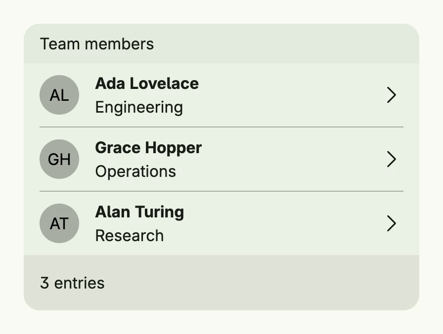

A list shows entries in a card with an optional caption and footer. `list.Entry` is the typical row
with a leading view, a headline, a supporting text and a trailing view. Rows can be clicked.



```go
func view(wnd core.Window) core.View {
    person := func(name, role string) list.TEntry {
        return list.Entry().
            Leading(avatar.Text(name)).
            Headline(name).
            SupportingText(role).
            Trailing(ImageIcon(icons.ChevronRight)).
            Action(func() {
                // navigate to the details of the person
            })
    }

    return list.List(
        person("Ada Lovelace", "Engineering"),
        person("Grace Hopper", "Operations"),
        person("Alan Turing", "Research"),
    ).
        Caption(Text("Team members")).
        Footer(Text("3 entries")).
        Frame(Frame{Width: L400})
}
```

## Constructors

### List

```go
func List(entries ...core.View) TList
```

List creates a new TList with the given entries as rows.

### Entry

```go
func Entry() TEntry
```

Entry creates a new full-width entry with default frame.

## Methods

### List

| Method | Description |
|--------|-------------|
| `Caption(s core.View) TList` | Caption sets an optional caption view above the list. |
| `ColorBody(color ui.Color) TList` | ColorBody sets the background color of the entries. |
| `ColorCaption(color ui.Color) TList` | ColorCaption sets the background color of the caption. |
| `ColorFooter(color ui.Color) TList` | ColorFooter sets the background color of the footer. |
| `ColorHighlight(color ui.Color) TList` | ColorHighlight sets the background color of highlighted entries. |
| `ColorHover(color ui.Color) TList` | ColorHover sets the background color of a hovered entry. |
| `Footer(s core.View) TList` | Footer sets an optional footer view below the list. |
| `Frame(frame ui.Frame) TList` | Frame sets the layout frame of the list. |
| `FullWidth() TList` | FullWidth expands the list to use the full available width. |
| `OnEntryClicked(fn func(idx int)) TList` | OnEntryClicked sets a callback for when a row is clicked. |
| `OnHighlighted(fn func(idx int) bool) TList` | OnHighlighted sets a predicate which decides whether the entry at idx is highlighted. |
| `With(fn func(c TList) TList) TList` | With applies the given function to the list, which helps with conditional configuration. |

### Entry

| Method | Description |
|--------|-------------|
| `Action(fn func()) TEntry` | Action sets a click/tap action handler. |
| `Frame(frame ui.Frame) TEntry` | Frame sets the layout frame for the entry. |
| `Headline(s string) TEntry` | Headline sets the main title text of the entry. |
| `HeadlineView(view core.View) TEntry` | HeadlineView sets a custom view instead of the headline text. |
| `Leading(v core.View) TEntry` | Leading sets an optional leading view, e.g. an avatar or icon. |
| `SupportingText(s string) TEntry` | SupportingText sets an optional supporting text below the headline. |
| `SupportingView(view core.View) TEntry` | SupportingView sets an optional supporting view below the headline. |
| `Trailing(v core.View) TEntry` | Trailing sets an optional trailing view, e.g. an icon or a button. |

## Related

- [Data View](../data_view/)
- [Avatar](../avatar/)
- Tutorial [tutorial-36-list](/docs/examples/tutorial-36-list/)
- Tutorial [tutorial-90-long-list](/docs/examples/tutorial-90-long-list/)
