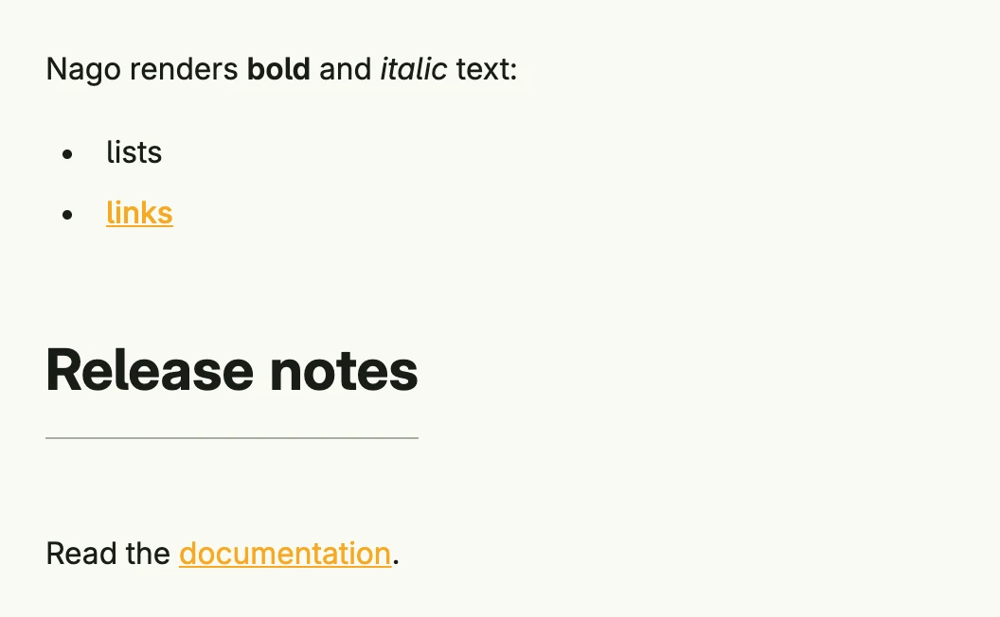

Package `presentation/ui/markdown` turns Markdown (GitHub flavored, parsed with goldmark) into views, e.g. for
texts from a CMS or answers of an AI model. `RichText` converts the Markdown to HTML and shows it in a
[Rich Text](../../basic/rich_text/), so lists, emphasis, tables and links work. `Render` without the `RichText`
option builds native views instead, but only supports headings, paragraphs, plain text and links.



```go
VStack(
	markdown.RichText("Nago renders **bold** and *italic* text:\n\n- lists\n- [links](https://www.nago.dev)"),
	markdown.Render(markdown.Options{Window: wnd}, []byte("## Release notes\n\nRead the [documentation](https://www.nago.dev).")),
).Alignment(Leading).Gap(L32).Frame(Frame{Width: L480})
```

`markdown.Options` has the fields `Window` (required for links in native views), `RichText` (render as HTML
instead of native views) and `TrimParagraph` (remove the enclosing paragraph of the HTML, so that a single line
needs no extra spacing). `RichText` sets both flags.

## Constructors

| Constructor | Description |
|-------------|-------------|
| `func RichText(value string) ui.TRichText` | RichText is a little helper factory to get some markdown text into a RichText. |
| `func Render(opts Options, source []byte) core.View` | Render parses the given source as a markdown dialect and interprets it as views. |

## Methods

The package has no component type of its own. `RichText` returns a `ui.TRichText`, see the methods of
[Rich Text](../../basic/rich_text/).

## Related

- [Rich Text](../../basic/rich_text/), [Rich Text Editor](../rich_text_editor/), [Text](../../basic/text/)
- Tutorials: [AI](/docs/examples/tutorial-77-ai/)
