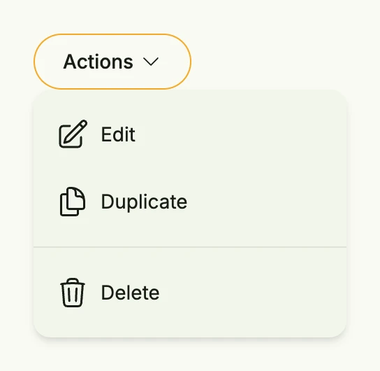

A menu opens a popup with actions when the user clicks the anchor view, e.g. a button. Items are grouped
by `MenuGroup`, and groups are separated by a line.



```go
func view(wnd core.Window) core.View {
    item := func(icon core.SVG, title string) TMenuItem {
        return MenuItem(func() {
            // perform the action
        }, HStack(ImageIcon(icon), Text(title)).Gap(L8))
    }

    return VStack(
        Menu(
            SecondaryButton(nil).Title("Actions").PostIcon(icons.ChevronDown),
            MenuGroup(
                item(icons.PencilSquare, "Edit"),
                item(icons.DocumentDuplicate, "Duplicate"),
            ),
            MenuGroup(
                item(icons.Trash, "Delete"),
            ),
        ),
    ).Alignment(TopLeading).Frame(Frame{Height: L256, Width: L320})
}
```

`MenuGroup(items ...TMenuItem)` creates a group, `MenuItem(action, content)` an item. Use
`TMenuGroup.CustomContent` to show an arbitrary view instead of the items.

## Constructors

```go
func Menu(anchor core.View, groups ...TMenuGroup) TMenu
```

Menu creates a new menu with the given anchor and groups.

## Methods

| Method | Description |
|--------|-------------|
| `Frame(frame Frame) TMenu` | Frame sets the layout frame of the menu. |
| `Offset(offset Length) TMenu` | Offset sets the offset of the menu from its anchor. |

## Related

- [Button](../../basic/button/)
