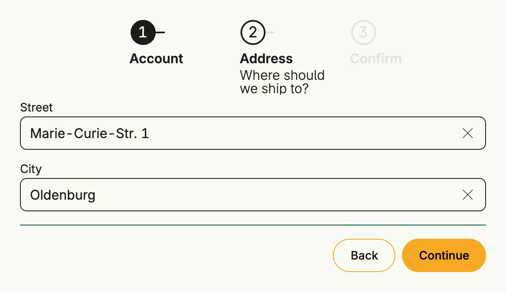

`form.MultiSteps` splits a long form into steps. It shows a stepper, the body of the current step and
back and next buttons. On the last step, the done button replaces the next button. Use `CanShow` or
`OnStepChange` to validate before the user continues.



```go
func view(wnd core.Window) core.View {
    step := core.AutoState[int](wnd).Init(func() int { return 1 })
    street := core.AutoState[string](wnd).Init(func() string { return "Marie-Curie-Str. 1" })
    city := core.AutoState[string](wnd).Init(func() string { return "Oldenburg" })

    return form.MultiSteps(
        form.Step(Text("Your account is ready.")).Headline("Account"),
        form.Step(
            VStack(
                TextField("Street", street.Get()).InputValue(street).FullWidth(),
                TextField("City", city.Get()).InputValue(city).FullWidth(),
            ).Gap(L16).FullWidth(),
        ).Headline("Address").SupportingText("Where should we ship to?"),
        form.Step(Text("Check your input and confirm.")).Headline("Confirm"),
    ).
        InputValue(step).
        ButtonDone(PrimaryButton(func() {
            // save the data
        }).Title("Finish")).
        Frame(Frame{Width: L560})
}
```

`form.Step(body)` creates a step, `Headline` and `SupportingText` describe it in the stepper.

## Constructors

```go
func MultiSteps(steps ...TStep) TMultiSteps
```

MultiSteps creates a new TMultiSteps with the provided steps.

## Methods

| Method | Description |
|--------|-------------|
| `BackLabel(label string) TMultiSteps` | BackLabel replaces the localized default label of the back button. |
| `ButtonDone(view core.View) TMultiSteps` | ButtonDone sets the view to display when the steps are completed. |
| `CanShow(fn func(currentIdx int, wantedIndex int) bool) TMultiSteps` | CanShow sets a predicate to control whether a given step can be shown. |
| `ColorCurrent(color ui.Color) TMultiSteps` | ColorCurrent sets the color for the currently active step indicator. |
| `ColorDone(color ui.Color) TMultiSteps` | ColorDone sets the color for completed step indicators. |
| `ColorFuture(color ui.Color) TMultiSteps` | ColorFuture sets the color for upcoming step indicators. |
| `Frame(frame ui.Frame) TMultiSteps` | Frame sets the layout frame of the multi-steps component. |
| `InputValue(idx *core.State[int]) TMultiSteps` | InputValue binds the active step index state to the multi-steps component. |
| `Layout(layout stepper.StepperLayout) TMultiSteps` | Layout sets the layout of the stepper, which is chosen automatically by default. |
| `NextLabel(label string) TMultiSteps` | NextLabel replaces the localized default label of the next button. |
| `OnStepChange(fn func(from, to int) bool) TMultiSteps` | OnStepChange sets a callback which is invoked when the user navigates from one step to another using the back or next button. |

## Related

- [Stepper](../stepper/)
- [Form](../form/)
