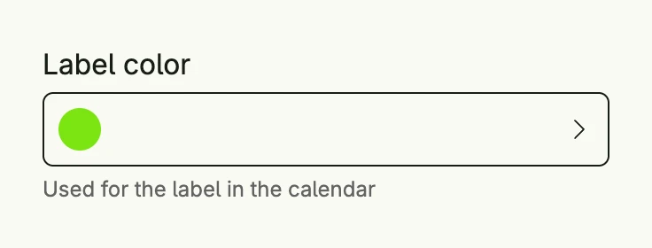

The palette picker selects a color from a predefined palette. The field shows the current color, a
click opens a dialog with the palette. `colorpicker.DefaultPalette` contains a balanced set of colors.



```go
func view(wnd core.Window) core.View {
    color := core.AutoState[Color](wnd).Init(func() Color { return colorpicker.DefaultPalette[3] })

    return colorpicker.PalettePicker("Label color", colorpicker.DefaultPalette).
        Value(color.Get()).
        State(color).
        Title("Choose a color").
        SupportingText("Used for the label in the calendar").
        Frame(Frame{Width: L320})
}
```

## Constructors

```go
func PalettePicker(label string, p Palette) TPalettePicker
```

PalettePicker creates a color picker with the given label which offers the colors of the palette, e.g.
`colorpicker.DefaultPalette`.

## Methods

| Method | Description |
|--------|-------------|
| `AccessibilityLabel(label string) ui.DecoredView` | AccessibilityLabel sets the label for screen readers. |
| `Border(border ui.Border) ui.DecoredView` | Border sets the border. |
| `Dialog(pickerPresented *core.State[bool]) core.View` | Dialog returns the dialog view as if pressed on the actual button. |
| `Disabled(disabled bool) TPalettePicker` | Disabled disables the user interaction. |
| `ErrorText(text string) TPalettePicker` | ErrorText sets a validation message below the field. |
| `Frame(frame ui.Frame) ui.DecoredView` | Frame sets the layout frame. |
| `Padding(padding ui.Padding) ui.DecoredView` | Padding sets the inner padding. |
| `State(state *core.State[ui.Color]) TPalettePicker` | State attaches the given state to the interaction process of selecting a value. |
| `SupportingText(text string) TPalettePicker` | SupportingText sets a hint below the field. |
| `Title(title string) TPalettePicker` | Title sets the title of the palette dialog. |
| `Value(color ui.Color) TPalettePicker` | Value sets the selected value. |
| `Visible(visible bool) ui.DecoredView` | Visible shows or hides the component. |
| `WithFrame(fn func(ui.Frame) ui.Frame) ui.DecoredView` | WithFrame transforms the current frame with the given function. |

## Related

- [Picker](../picker/)
- Tutorial [tutorial-33-colorpicker](/docs/examples/tutorial-33-colorpicker/)
