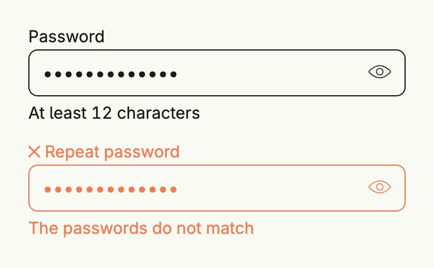

The password field is a text field for secrets. It hides the input and lets the user reveal it. Never
send a stored secret back to the browser: only fill in a value which the user has just entered.



```go
func view(wnd core.Window) core.View {
    password := core.AutoState[string](wnd).Init(func() string { return "correct horse" })
    repeated := core.AutoState[string](wnd).Init(func() string { return "correct house" })

    return VStack(
        PasswordField("Password", password.Get()).
            InputValue(password).
            SupportingText("At least 12 characters").
            FullWidth(),
        PasswordField("Repeat password", repeated.Get()).
            InputValue(repeated).
            ErrorText("The passwords do not match").
            FullWidth(),
    ).Gap(L16).Frame(Frame{Width: L320})
}
```

## Constructors

```go
func PasswordField(label string, value string) TPasswordField
```

PasswordField represents a secret entered by the user.

## Methods

| Method | Description |
|--------|-------------|
| `AccessibilityLabel(label string) DecoredView` | AccessibilityLabel sets an accessibility label for screen readers. |
| `AutoComplete(autoComplete bool) TPasswordField` | AutoComplete enables or disables browser autocomplete for the field. |
| `Autocomplete(tags string) TPasswordField` | Autocomplete defines the autocomplete tags of the input |
| `Border(border Border) DecoredView` | Border sets the border styling of the field. |
| `Debounce(enabled bool) TPasswordField` | Debounce is enabled by default. |
| `DebounceTime(d time.Duration) TPasswordField` | DebounceTime sets a custom debouncing time when entering text. |
| `Disabled(disabled bool) TPasswordField` | Disabled enables or disables the field. |
| `ErrorText(text string) TPasswordField` | ErrorText sets the error message displayed when validation fails. |
| `Frame(frame Frame) DecoredView` | Frame sets the layout frame for the field. |
| `FullWidth() TPasswordField` | FullWidth expands the field to take up the full available width. |
| `ID(id string) TPasswordField` | ID sets a unique identifier for the field. |
| `InputValue(input *core.State[string]) TPasswordField` | InputValue binds the password field to the given state for two-way data binding. |
| `KeydownEnter(fn func()) TPasswordField` | KeydownEnter sets a callback function to be triggered when the Enter key is pressed. |
| `Label(label string)` | Label sets the field label. |
| `Lines(lines int) TPasswordField` | Lines are by default at 0 and enforces a single line text field. |
| `Padding(padding Padding) DecoredView` | Padding sets the padding around the field. |
| `Style(s TextFieldStyle) TPasswordField` | Style sets the wanted style. |
| `SupportingText(text string) TPasswordField` | SupportingText sets helper text displayed below the field. |
| `Value(value string) TPasswordField` | Value sets the initial value of the password field. |
| `Visible(v bool) DecoredView` | Visible sets the field's visibility. |
| `WithFrame(fn func(Frame) Frame) DecoredView` | WithFrame applies a transformation function to the field's frame. |

## Related

- [Text Field](../../basic/text_field/)
- [Form](../form/)
- Tutorial [tutorial-12-textfield](/docs/examples/tutorial-12-textfield/)
