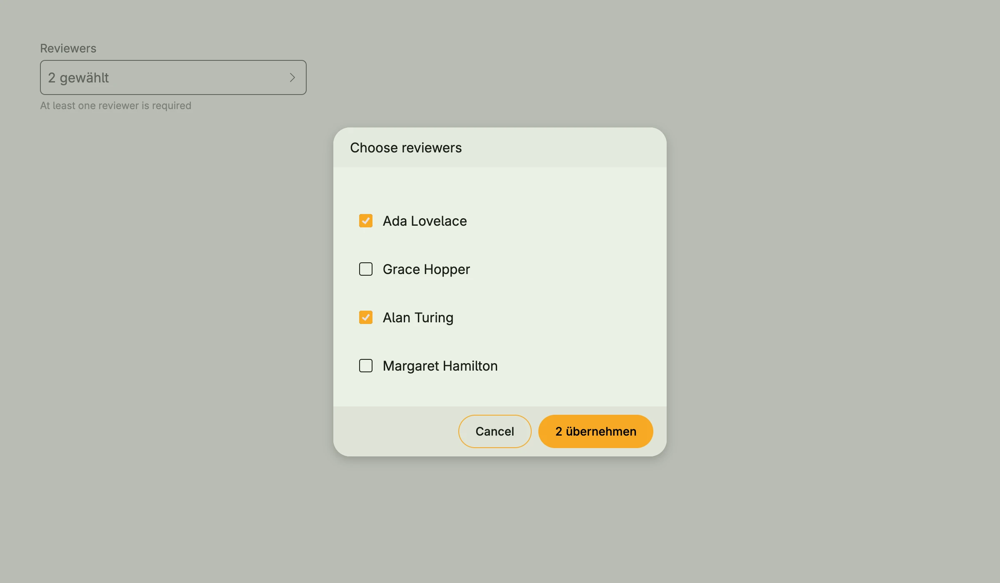

The picker selects one or more values from a slice. The field shows the current selection, a click
opens a dialog with all values. With more than 10 values, the dialog shows a quick filter. Values are
shown by `Stringer`, by their `String` method or by `ItemRenderer2`.



```go
type person struct {
    Name string
    Team string
}

func (p person) String() string {
    return p.Name
}

func view(wnd core.Window) core.View {
    people := []person{
        {"Ada Lovelace", "Engineering"},
        {"Grace Hopper", "Operations"},
        {"Alan Turing", "Research"},
        {"Margaret Hamilton", "Engineering"},
    }

    selected := core.AutoState[[]person](wnd).Init(func() []person {
        return []person{people[0], people[2]}
    })

    // open the dialog right away, as if the user had clicked the field
    presented := core.AutoState[bool](wnd).Init(func() bool { return true })

    return picker.Picker[person]("Reviewers", people, selected).
        WithDialogPresented(presented).
        MultiSelect(true).
        Title("Choose reviewers").
        SupportingText("At least one reviewer is required").
        Frame(Frame{Width: L320})
}
```

The example opens the dialog right away. Usually, you just pass the selection state and the user opens
the dialog by clicking the field.

## Constructors

```go
func FromData[E data.Aggregate[ID], ID ~string](label string, selectedState *core.State[[]E], data Data[E, ID]) TPicker[E]
```

FromData is similar to the dataview package.

```go
func Picker[T any](label string, values []T, selectedState *core.State[[]T]) TPicker[T]
```

Picker takes the given slice and state to represent the selection.

## Methods

| Method | Description |
|--------|-------------|
| `AccessibilityLabel(label string) ui.DecoredView` | AccessibilityLabel sets the label for screen readers. |
| `Border(border ui.Border) ui.DecoredView` | Border sets the border. |
| `DetailView(detailView core.View) TPicker[T]` | DetailView is optional and placed between the picker section and the button footer. |
| `Dialog() core.View` | Dialog returns the dialog view as if pressed on the actual button. |
| `DialogOptions(opts ...alert.Option) TPicker[T]` | DialogOptions passes options like the height to the selection dialog. |
| `DialogPresented() *core.State[bool]` | DialogPresented returns the state which controls whether the dialog is shown. |
| `Disabled(disabled bool) TPicker[T]` | Disabled disables the user interaction. |
| `ErrorText(text string) TPicker[T]` | ErrorText sets a validation message below the field. |
| `Frame(frame ui.Frame) ui.DecoredView` | Frame sets the layout frame. |
| `FullWidth() TPicker[T]` | FullWidth expands the component to the full available width. |
| `ItemPickedRenderer(fn func([]T) core.View) TPicker[T]` | ItemPickedRenderer can be customized to return a non-text view for the given T. This is shown within the selected window for the currently selected items. |
| `ItemRenderer(fn func(T) core.View) TPicker[T]` | Deprecated: use ItemRenderer2 ItemRenderer can be customized to return a non-text view for the given T. This is shown within the picker popup. |
| `ItemRenderer2(fn func(wnd core.Window, item T, state *core.State[bool]) core.View) TPicker[T]` | ItemRenderer2 can be customized to return a non-text view for the given T. This is shown within the picker popup. |
| `MultiSelect(mv bool) TPicker[T]` | MultiSelect is by default false. |
| `Padding(padding ui.Padding) ui.DecoredView` | Padding sets the inner padding. |
| `QuickFilterSupported(flag bool) TPicker[T]` | QuickFilterSupported sets the quick-filter-support and if true and values contains more than 10 items, the quick filter is shown. |
| `SelectAllSupported(flag bool) TPicker[T]` | SelectAllSupported sets the select-all-support and if true and multiSelect is enabled, a checkbox to select all is shown. |
| `Stringer(stringer func(T) string) TPicker[T]` | Stringer sets the function which converts a value into its display text. |
| `SupportingText(text string) TPicker[T]` | SupportingText sets a hint below the field. |
| `Title(title string) TPicker[T]` | Title sets the title of the selection dialog. |
| `Visible(visible bool) ui.DecoredView` | Visible shows or hides the component. |
| `WithDialogPresented(state *core.State[bool]) TPicker[T]` | WithDialogPresented uses the given state to show or hide the dialog. |
| `WithFrame(fn func(ui.Frame) ui.Frame) ui.DecoredView` | WithFrame transforms the current frame with the given function. |

## Related

- [Data View](../data_view/)
- [Palette Picker](../palette_picker/)
- Tutorial [tutorial-27-picker](/docs/examples/tutorial-27-picker/)
