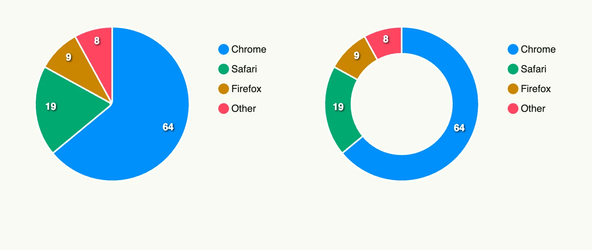

A pie chart shows the share of each part in a whole. Each data point of the series becomes a slice,
labelled by its `X` value. `ShowAsDonut` renders a ring instead of a pie.



```go
func view(wnd core.Window) core.View {
    series := []chart.Series{
        {
            Label: "Browser",
            DataPoints: []chart.DataPoint{
                {X: "Chrome", Y: 64}, {X: "Safari", Y: 19}, {X: "Firefox", Y: 9}, {X: "Other", Y: 8},
            },
        },
    }

    cfg := chart.Chart{Frame: Frame{}.Size(L320, L256)}

    return HStack(
        piechart.PieChart(cfg).Series(series),
        piechart.PieChart(cfg).Series(series).ShowAsDonut(true),
    ).Gap(L32)
}
```

## Constructors

```go
func PieChart(chart chart.Chart) TPieChart
```

PieChart creates a pie chart with the given chart configuration. Add the data with `Series`.

## Methods

| Method | Description |
|--------|-------------|
| `Chart(chart chart.Chart) TPieChart` | Chart sets the chart configuration. |
| `Series(series []chart.Series) TPieChart` | Series sets the data series. |
| `ShowAbsoluteValues(showAbsoluteValues bool) TPieChart` | ShowAbsoluteValues shows the values instead of percentages. |
| `ShowAsDonut(showAsDonut bool) TPieChart` | ShowAsDonut renders a donut instead of a pie. |
| `ShowDataLabels(showDataLabels bool) TPieChart` | ShowDataLabels shows or hides the labels on the slices. |

## Related

- [Bar Chart](../bar_chart/)
- [Line Chart](../line_chart/)
- Tutorial [tutorial-79-pie-chart](/docs/examples/tutorial-79-pie-chart/)
