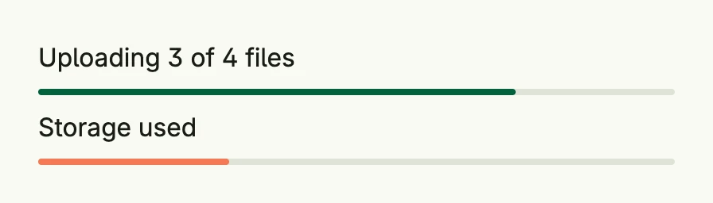

`progress.LinearProgress` shows a horizontal progress bar for a value between 0 and 1. Use it for
uploads, long running jobs or quotas.



```go
func view(wnd core.Window) core.View {
    return VStack(
        Text("Uploading 3 of 4 files"),
        progress.LinearProgress().Progress(0.75),
        Text("Storage used"),
        progress.LinearProgress().Progress(0.3).Color(SE0),
    ).Alignment(Leading).Gap(L8).Frame(Frame{Width: L400})
}
```

## Constructors

```go
func LinearProgress() TProgress
```

LinearProgress creates a horizontal progress bar with default accent color, card footer background, full width, and standard height.

## Methods

| Method | Description |
|--------|-------------|
| `BackgroundColor(color ui.Color) TProgress` | BackgroundColor sets the background color of the unfilled portion of the bar. |
| `Color(color ui.Color) TProgress` | Color sets the foreground color of the progress indicator. |
| `Frame(frame ui.Frame) TProgress` | Frame sets the layout frame of the progress bar, including size and spacing. |
| `FullWidth() TProgress` | FullWidth sets the progress bar to span the full available width. |
| `Progress(v float64) TProgress` | Progress must be between 0 and 1. |
| `Style(style Style) TProgress` | Style sets the visual style of the progress bar (e.g., horizontal or circular). |

## Related

- [Countdown](../countdown/)
- Tutorial [tutorial-51-progress](/docs/examples/tutorial-51-progress/)
