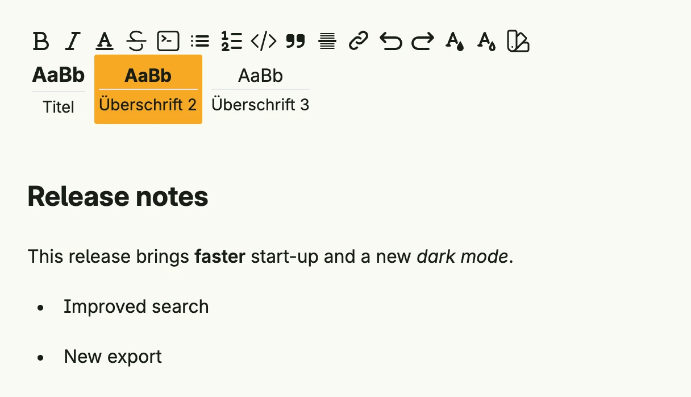

The rich text editor edits formatted text with a toolbar for headings, lists, links, colors and more.
The value is HTML. Show the result with `RichText`.



```go
func view(wnd core.Window) core.View {
    html := core.AutoState[string](wnd).Init(func() string {
        return "<h2>Release notes</h2><p>This release brings <b>faster</b> start-up and a new <i>dark mode</i>.</p><ul><li>Improved search</li><li>New export</li></ul>"
    })

    return RichTextEditor(html.Get()).
        InputValue(html).
        Frame(Frame{Width: L560})
}
```

## Constructors

```go
func RichTextEditor(value string) TRichTextEditor
```

RichTextEditor creates a new rich text editor with the given initial value.

## Methods

| Method | Description |
|--------|-------------|
| `Frame(frame Frame) TRichTextEditor` | Frame sets the layout frame of the editor. |
| `FullWidth() TRichTextEditor` | FullWidth expands the editor to take the full available width. |
| `InputValue(state *core.State[string]) TRichTextEditor` | InputValue binds the editor's content to a state, enabling two-way data binding. |

## Related

- [Rich Text](../../basic/rich_text/)
- [Code Editor](../code_editor/)
- Tutorial [tutorial-58-richtext](/docs/examples/tutorial-58-richtext/)
