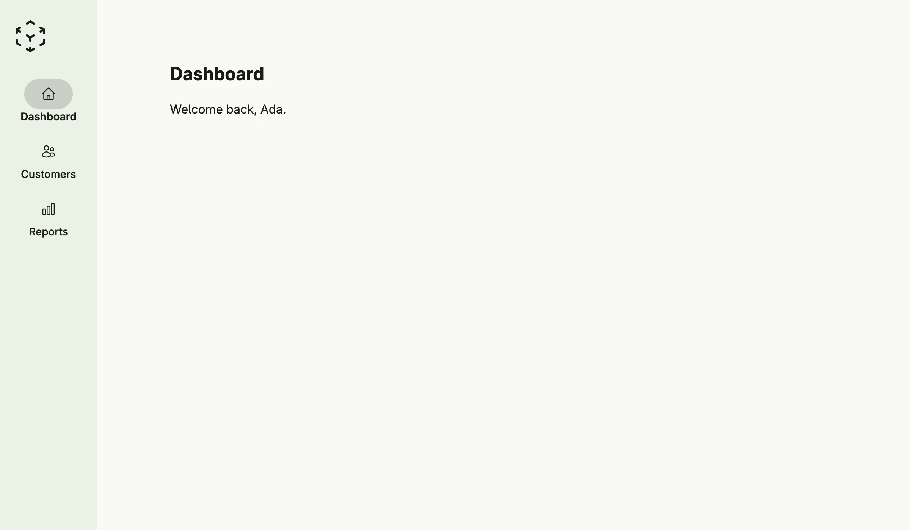

The scaffold is the frame of an application: logo, navigation menu, body, footer and an optional bottom
view, e.g. for the profile. The navigation is shown at the top or at the leading side and collapses into a
burger menu below the breakpoint. Usually you do not create it yourself but use `cfg.NewScaffold()` as
decorator, which also adds the login and the admin center.



```go
func view(wnd core.Window) core.View {
    return Scaffold(ScaffoldAlignmentLeading).
        Logo(Image().Embed(icons.CubeTransparent).Frame(Frame{}.Size(L48, L48))).
        Menu(
            ForwardScaffoldMenuEntry(wnd, icons.Home, "Dashboard", "scaffold"),
            ForwardScaffoldMenuEntry(wnd, icons.Users, "Customers", "customers"),
            ParentScaffoldMenuEntry(wnd, icons.ChartBar, "Reports",
                ScaffoldMenuEntry{Title: "Sales"},
                ScaffoldMenuEntry{Title: "Inventory"},
            ),
        ).
        Body(VStack(
            Text("Dashboard").Font(Title),
            Text("Welcome back, Ada."),
        ).Alignment(Leading).Gap(L16).Padding(Padding{}.All(L32)))
}
```

`ForwardScaffoldMenuEntry` creates an entry which navigates to a path and is highlighted there,
`ParentScaffoldMenuEntry` an entry with a sub menu. Set the fields of `ScaffoldMenuEntry` directly for
custom actions or views.

## Constructors

```go
func Scaffold(alignment ScaffoldAlignment) TScaffold
```

Scaffold creates a new scaffold with the given alignment.

## Methods

| Method | Description |
|--------|-------------|
| `Alignment(alignment ScaffoldAlignment) TScaffold` | Alignment places the navigation at the top or at the leading side. |
| `Body(view core.View) TScaffold` | Body sets the main content body of the scaffold. |
| `BodyFullSize(fullSize bool) TScaffold` | BodyFullSize lets the body use the full size of the content area. |
| `BottomView(view core.View) TScaffold` | BottomView sets the optional bottom view of the scaffold, often used for secondary actions like user profile or settings. |
| `Breakpoint(breakpoint int) TScaffold` | Breakpoint sets the window width, from which the scaffold shows its navigation bar or sidebar instead of the burger menu. |
| `Footer(view core.View) TScaffold` | Footer sets the footer content of the scaffold. |
| `Height(height Length) TScaffold` | Height sets the height of the scaffold. |
| `Logo(view core.View) TScaffold` | Logo sets the logo or brand element of the scaffold. |
| `Menu(items ...ScaffoldMenuEntry) TScaffold` | Menu sets the navigation menu entries for the scaffold. |

## Related

- [Screen](../screen/)
- Tutorial [tutorial-17-scaffold](/docs/examples/tutorial-17-scaffold/)
- Tutorial [tutorial-52-scaffoldbuilder](/docs/examples/tutorial-52-scaffoldbuilder/)
