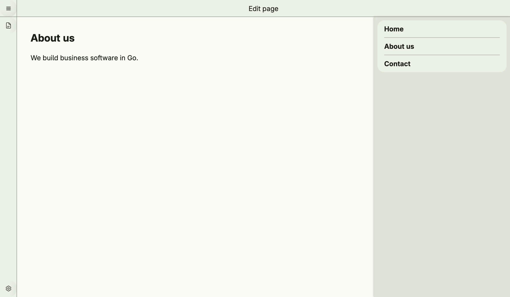

`editor.Screen` is the full window layout of an editor, as used by the CMS: a header, a narrow navbar
with tool buttons, tool windows at the leading or trailing side, the content area and modals. The navbar
buttons usually toggle the visibility of the tool windows.



```go
func view(wnd core.Window) core.View {
    pagesVisible := core.AutoState[bool](wnd).Init(func() bool { return true })

    pages := editor.ToolWindow(icons.DocumentText, "Pages").
        Content(VStack(
            list.List(
                list.Entry().Headline("Home"),
                list.Entry().Headline("About us"),
                list.Entry().Headline("Contact"),
            ).FullWidth(),
        ).FullWidth().Padding(Padding{}.All(L8))).
        Visible(pagesVisible.Get())

    return editor.Screen("Pages").
        Header(editor.Header(wnd).Center(Text("Edit page"))).
        Navbar(editor.Navbar().
            Top(TertiaryButton(func() {
                pagesVisible.Set(!pagesVisible.Get())
            }).PreIcon(icons.DocumentText)).
            Bottom(TertiaryButton(nil).PreIcon(icons.Cog6Tooth)),
        ).
        TrailingToolWindow(pages).
        Content(editor.Content(
            VStack(
                Text("About us").Font(Title),
                Text("We build business software in Go."),
            ).Alignment(Leading).Gap(L16),
        ).Style(editor.ContentPage))
}
```

`editor.Header(wnd)` creates the header with a menu button to go back, `editor.Content(view)` the content
area, either full size (`ContentFull`) or as a page (`ContentPage`). `editor.ToolWindowList` creates a tool
window with a list of entities, including create, select and delete.

## Constructors

### Screen

```go
func Screen(title string) TScreen
```

Screen creates a new TScreen with the given title.

### Header

```go
func Header(wnd core.Window) THeader
```

Header creates a new THeader for the given window. By default, it includes a menu button in the leading corner
with a "Back" navigation item.

### Content

```go
func Content(view core.View) TContent
```

Content creates a new TContent with the given view.

### Navbar

```go
func Navbar() TNavbar
```

Navbar creates a new TNavbar with visibility enabled by default.

### Tool Window

```go
func ToolWindow(icon core.SVG, name string) TVToolWindow
```

ToolWindow creates a new TVToolWindow with the given icon and name.

```go
func ToolWindowList[T data.Aggregate[ID], ID data.IDType](wnd core.Window, cfg ToolWindowListConfig[T, ID]) TVToolWindow
```

ToolWindowList creates a TVToolWindow that displays a list of items based on the provided configuration.

## Methods

### Screen

| Method | Description |
|--------|-------------|
| `Content(content TContent) TScreen` | Content sets the main content area of the screen. |
| `Header(header THeader) TScreen` | Header sets the header section of the screen. |
| `LeadingToolWindows(leading ...TVToolWindow) TScreen` | LeadingToolWindows sets the leading-side tool windows of the screen. |
| `Modals(modals ...core.View) TScreen` | Modals sets the modal dialogs of the screen. |
| `Navbar(navbar TNavbar) TScreen` | Navbar sets the navigation bar of the screen. |
| `TrailingToolWindow(tailing TVToolWindow) TScreen` | TrailingToolWindow sets the trailing-side tool window of the screen. |

### Header

| Method | Description |
|--------|-------------|
| `Center(views ...core.View) THeader` | Center sets the center region of the header to the given views. |
| `Leading(views ...core.View) THeader` | Leading sets the leading region of the header to the given views. |

### Content

| Method | Description |
|--------|-------------|
| `Style(style ContentStyle) TContent` | Style applies the given ContentStyle to the TContent: `ContentFull` or `ContentPage`. |

### Navbar

| Method | Description |
|--------|-------------|
| `Bottom(views ...core.View) TNavbar` | Bottom sets the bottom section of the navbar to the given views. |
| `Top(views ...core.View) TNavbar` | Top sets the top section of the navbar to the given views. |

### Tool Window

| Method | Description |
|--------|-------------|
| `Bottom(v ui.DecoredView) TVToolWindow` | Bottom sets the bottom section of the tool window to the given view. |
| `Content(v ui.DecoredView) TVToolWindow` | Content sets the main content section of the tool window to the given view. |
| `Top(v ui.DecoredView) TVToolWindow` | Top sets the top section of the tool window to the given view. |
| `Visible(b bool) TVToolWindow` | Visible sets the visibility state of the tool window. |

## Related

- [Scaffold](../scaffold/)
- [List](../list/)
