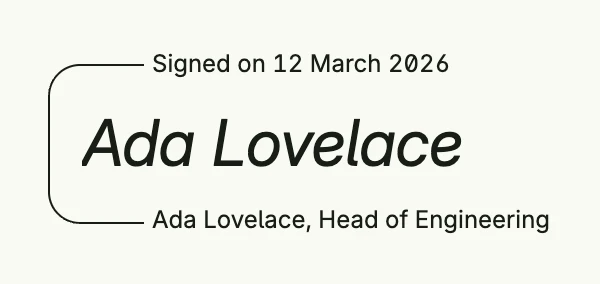

`esignature.Signature` displays a signature: a body, e.g. the name or an image of the handwritten
signature, framed by a text above and below. It only renders; the signature system provides the
infrastructure to capture and verify signatures.



```go
func view(wnd core.Window) core.View {
    return esignature.Signature().
        TopText("Signed on 12 March 2026").
        Body(Text("Ada Lovelace").Font(Font{Size: L32, Style: ItalicFontStyle})).
        BottomText("Ada Lovelace, Head of Engineering")
}
```

## Constructors

```go
func Signature() TSignature
```

Signature creates a new, empty TSignature.

## Methods

| Method | Description |
|--------|-------------|
| `Body(v core.View) TSignature` | Body sets the main body view of the signature. |
| `BottomText(text string) TSignature` | BottomText sets the text displayed below the signature body. |
| `Frame(frame ui.Frame) TSignature` | Frame sets the frame of the signature container. |
| `TopText(text string) TSignature` | TopText sets the text displayed above the signature body. |

## Related

- [Text](../../basic/text/)
- Tutorial [tutorial-69-esignature](/docs/examples/tutorial-69-esignature/)
