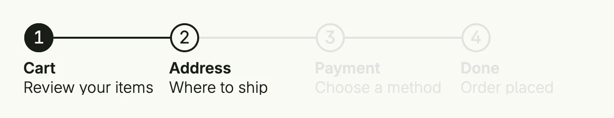

The stepper shows the progress through a sequence of steps. It only displays the steps; bind the index
of the current step with `InputValue` and change it from your own buttons. For a form with steps and
navigation buttons, use Multi Steps.



```go
func view(wnd core.Window) core.View {
    current := core.AutoState[int](wnd).Init(func() int { return 1 })

    return VStack(
        stepper.Stepper(
            stepper.Step().Headline("Cart").SupportingText("Review your items"),
            stepper.Step().Headline("Address").SupportingText("Where to ship"),
            stepper.Step().Headline("Payment").SupportingText("Choose a method"),
            stepper.Step().Headline("Done").SupportingText("Order placed"),
        ).InputValue(current).Layout(stepper.StepperLayoutHorizontal),
    ).Frame(Frame{Width: L880})
}
```

The layout is chosen automatically by default. Use `Layout` with `StepperLayoutHorizontal`,
`StepperLayoutVertical`, `StepperLayoutSimple` or `StepperLayoutSimpleList` to fix it.

## Constructors

```go
func Stepper(steps ...TStep) TStepper
```

Stepper creates a new stepper with the given steps

## Methods

| Method | Description |
|--------|-------------|
| `CompletedTextPattern(pattern string) TStepper` | CompletedTextPattern overwrites the default text pattern for completed simple steppers. |
| `InputValue(state *core.State[int]) TStepper` | InputValue sets a step index state, that will be used instead of the fixed value of the component |
| `Layout(layout StepperLayout) TStepper` | Layout sets a fixed layout for the stepper |
| `Lines(b bool) TStepper` | Lines defines whether to display lines in the stepper with the simple or simple list layout |
| `Numbers(b bool) TStepper` | Numbers defines whether to display step numbers in the stepper |
| `SimpleTextPattern(pattern string) TStepper` | SimpleTextPattern overwrites the default text pattern for the simple stepper layout. |
| `Steps(steps ...TStep) TStepper` | Steps sets the steps of the stepper. |
| `Value(value int) TStepper` | Value sets the current step index value |

## Related

- [Multi Steps](../multi_steps/)
- Tutorial [tutorial-97-stepper](/docs/examples/tutorial-97-stepper/)
