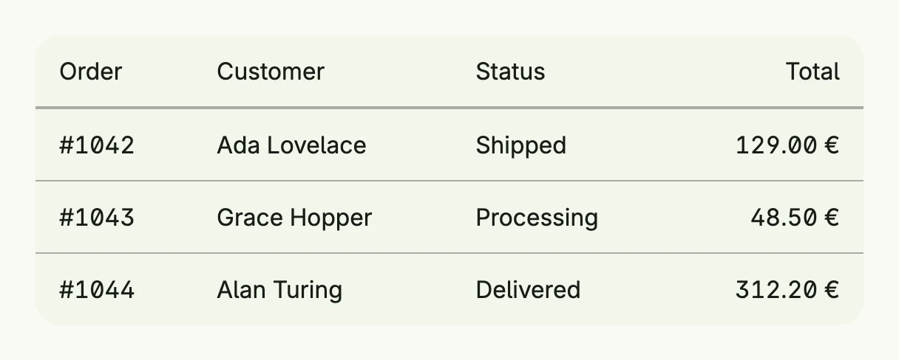

`Table` lays out rows and columns with a header, dividers and rounded borders. Cells contain arbitrary
views and can span rows and columns, rows and cells can be clicked. For collections with search,
sorting and selection, use the Data View.



```go
func view(wnd core.Window) core.View {
    type order struct {
        ID, Customer, Status, Total string
    }

    orders := []order{
        {"#1042", "Ada Lovelace", "Shipped", "129.00 €"},
        {"#1043", "Grace Hopper", "Processing", "48.50 €"},
        {"#1044", "Alan Turing", "Delivered", "312.20 €"},
    }

    return Table(
        TableColumn(Text("Order")),
        TableColumn(Text("Customer")),
        TableColumn(Text("Status")),
        TableColumn(Text("Total")).Alignment(Trailing),
    ).Rows(
        ForEach(orders, func(o order) TTableRow {
            return TableRow(
                TableCell(Text(o.ID)),
                TableCell(Text(o.Customer)),
                TableCell(Text(o.Status)),
                TableCell(Text(o.Total)).Alignment(Trailing),
            ).Action(func() {
                // open the order
            }).HoveredBackgroundColor(ColorCardFooter)
        })...,
    ).
        CellPadding(Padding{}.Horizontal(L16).Vertical(L12)).
        Border(Border{}.Radius(L16)).
        Frame(Frame{Width: L560})
}
```

## Constructors

```go
func Table(columns ...TTableColumn) TTable
```

Table creates a new table with the specified columns and default styling.

## Methods

| Method | Description |
|--------|-------------|
| `BackgroundColor(backgroundColor Color) TTable` | BackgroundColor sets the background color of the table. |
| `Border(border Border) TTable` | Border sets the border of the table. |
| `CellPadding(padding Padding) TTable` | CellPadding sets the default cell padding for all cells. |
| `Columns(columns ...TTableColumn) TTable` | Columns replaces the columns of the table. |
| `Frame(frame Frame) TTable` | Frame sets the frame of the table. |
| `HeaderDividerColor(color Color) TTable` | HeaderDividerColor sets the divider color between header and body. |
| `RowDividerColor(color Color) TTable` | RowDividerColor sets the divider color between rows. |
| `Rows(rows ...TTableRow) TTable` | Rows appends one or more rows to the table. |

## Related

- [Table Column](../../layout/table_column/)
- [Table Row](../../layout/table_row/)
- [Table Cell](../../layout/table_cell/)
- [Data View](../data_view/)
- Tutorial [tutorial-18-table](/docs/examples/tutorial-18-table/)
