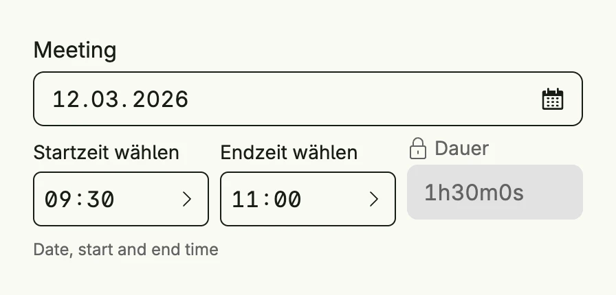

`timeframe.Picker` selects a day with a start and an end time and shows the resulting duration. The
value is an `xtime.TimeFrame` in Unix milliseconds with a time zone.



```go
func view(wnd core.Window) core.View {
    meeting := core.AutoState[xtime.TimeFrame](wnd).Init(func() xtime.TimeFrame {
        start := time.Date(2026, 3, 12, 9, 30, 0, 0, time.UTC)
        return xtime.TimeFrame{
            StartTime: xtime.UnixMilliseconds(start.UnixMilli()),
            EndTime:   xtime.UnixMilliseconds(start.Add(90 * time.Minute).UnixMilli()),
            Timezone:  "UTC",
        }
    })

    return timeframe.Picker("Meeting", meeting).
        Title("Schedule the meeting").
        SupportingText("Date, start and end time").
        Frame(Frame{Width: L400})
}
```

## Constructors

```go
func Picker(label string, selectedState *core.State[xtime.TimeFrame]) TPicker
```

Picker renders a xtime.TimeFrame picker to select at least a day and a start and end time (inclusive).

## Methods

| Method | Description |
|--------|-------------|
| `AccessibilityLabel(label string) ui.DecoredView` | AccessibilityLabel sets a label used by screen readers for accessibility. |
| `Border(border ui.Border) ui.DecoredView` | Border sets the border style of the picker. |
| `Disabled(disabled bool) TPicker` | Disabled enables or disables user interaction with the picker. |
| `ErrorText(text string) TPicker` | ErrorText sets the validation or error message displayed below the picker. |
| `Format(format PickerFormat) TPicker` | Format sets the picker format, which controls its display and interaction style. |
| `Frame(frame ui.Frame) ui.DecoredView` | Frame sets the layout frame of the picker, including size and positioning. |
| `Padding(padding ui.Padding) ui.DecoredView` | Padding sets the inner spacing around the picker content. |
| `SupportingText(text string) TPicker` | SupportingText sets helper or secondary text displayed below the picker label. |
| `Title(title string) TPicker` | Title sets the title of the picker, typically shown in dialogs. |
| `Visible(visible bool) ui.DecoredView` | Visible controls the visibility of the picker; setting false hides it. |
| `WithFrame(fn func(ui.Frame) ui.Frame) ui.DecoredView` | WithFrame applies a transformation function to the picker's frame and returns the updated component. |

## Related

- [Date Picker](../date_picker/)
- [Time Picker](../time_picker/)
- Tutorial [tutorial-100-timeframe](/docs/examples/tutorial-100-timeframe/)
