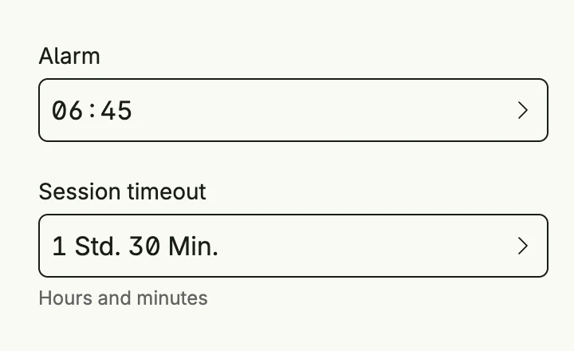

`timepicker.Picker` edits a `time.Duration`, either as a clock time (`ClockFormat`, e.g. 06:45) or
decomposed into days, hours, minutes and seconds (`DecomposedFormat`). Choose the visible units with
`Days`, `Hours`, `Minutes` and `Seconds`.



```go
func view(wnd core.Window) core.View {
    alarm := core.AutoState[time.Duration](wnd).Init(func() time.Duration {
        return 6*time.Hour + 45*time.Minute
    })
    timeout := core.AutoState[time.Duration](wnd).Init(func() time.Duration {
        return 1*time.Hour + 30*time.Minute
    })

    return VStack(
        timepicker.Picker("Alarm", alarm).
            Format(timepicker.ClockFormat).
            Frame(Frame{}.FullWidth()),
        timepicker.Picker("Session timeout", timeout).
            Format(timepicker.DecomposedFormat).
            Days(false).Seconds(false).
            SupportingText("Hours and minutes").
            Frame(Frame{}.FullWidth()),
    ).Gap(L16).Frame(Frame{Width: L320})
}
```

## Constructors

```go
func Picker(label string, selectedState *core.State[time.Duration]) TPicker
```

Picker renders a time.Duration either in clock time format or in decomposed format.

## Methods

| Method | Description |
|--------|-------------|
| `AccessibilityLabel(label string) ui.DecoredView` | AccessibilityLabel sets a label used by screen readers for accessibility. |
| `Border(border ui.Border) ui.DecoredView` | Border sets the border style of the time picker. |
| `Days(showDays bool) TPicker` | Days toggles whether the picker allows selecting days. |
| `Disabled(disabled bool) TPicker` | Disabled enables or disables user interaction with the time picker. |
| `ErrorText(text string) TPicker` | ErrorText sets the validation or error message displayed below the picker. |
| `Format(format PickerFormat) TPicker` | Format sets the display format for the duration value (clock or decomposed). |
| `Frame(frame ui.Frame) ui.DecoredView` | Frame sets the layout frame of the time picker, including size and positioning. |
| `Hours(showHours bool) TPicker` | Hours toggles whether the picker allows selecting hours. |
| `Minutes(showMinutes bool) TPicker` | Minutes toggles whether the picker allows selecting minutes. |
| `Padding(padding ui.Padding) ui.DecoredView` | Padding sets the inner spacing around the time picker content. |
| `Seconds(showSeconds bool) TPicker` | Seconds toggles whether the picker allows selecting seconds. |
| `SupportingText(text string) TPicker` | SupportingText sets helper or secondary text displayed below the picker label. |
| `Title(title string) TPicker` | Title sets the title of the picker, typically shown in dialogs. |
| `Visible(visible bool) ui.DecoredView` | Visible controls the visibility of the time picker; setting false hides it. |
| `WithFrame(fn func(ui.Frame) ui.Frame) ui.DecoredView` | WithFrame applies a transformation function to the picker's frame and returns the updated component. |

## Related

- [Date Picker](../date_picker/)
- [Time Frame Picker](../time_frame_picker/)
- Tutorial [tutorial-29-timepicker](/docs/examples/tutorial-29-timepicker/)
