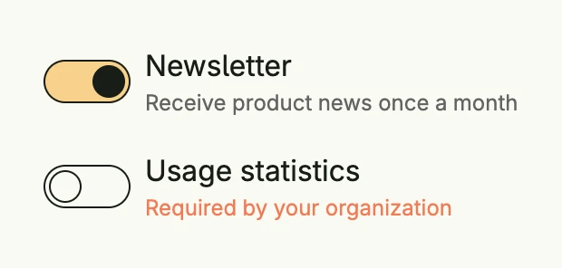

A toggle field combines a toggle with a label, a supporting text and an error text, like the other form
fields. Use it for on/off settings in forms.



```go
func view(wnd core.Window) core.View {
    newsletter := core.AutoState[bool](wnd).Init(func() bool { return true })
    tracking := core.AutoState[bool](wnd)

    return VStack(
        ToggleField("Newsletter", newsletter.Get()).
            InputValue(newsletter).
            SupportingText("Receive product news once a month"),
        ToggleField("Usage statistics", tracking.Get()).
            InputValue(tracking).
            ErrorText("Required by your organization"),
    ).Alignment(Leading).Gap(L16)
}
```

## Constructors

```go
func ToggleField(label string, value bool) TToggleField
```

A ToggleField aggregates a toggle together with form field typical labels, hints and error texts.

## Methods

| Method | Description |
|--------|-------------|
| `AccessibilityLabel(label string) DecoredView` | AccessibilityLabel sets the accessibility label for screen readers. |
| `Border(border Border) DecoredView` | Border sets the border styling of the toggle field. |
| `Disabled(disabled bool) TToggleField` | Disabled sets the disabled state of the toggle field |
| `ErrorText(text string) TToggleField` | ErrorText sets the error message displayed when validation fails. |
| `Frame(frame Frame) DecoredView` | Frame sets the layout frame of the toggle field. |
| `ID(id string) TToggleField` | ID sets the ID of the toggle field |
| `InputValue(inputValue *core.State[bool]) TToggleField` | InputValue binds the toggle field to a reactive state for two-way binding. |
| `Label(label string) TToggleField` | Label sets the label above the field. |
| `Padding(padding Padding) DecoredView` | Padding sets the inner padding of the toggle field. |
| `SupportingText(text string) TToggleField` | SupportingText sets optional supporting text displayed below the field. |
| `Value(value bool) TToggleField` | Value sets the current value. |
| `Visible(visible bool) DecoredView` | Visible controls the visibility of the toggle field. |
| `WithFrame(fn func(Frame) Frame) DecoredView` | WithFrame modifies the layout frame using the provided function. |

## Related

- [Toggle](../../basic/toggle/)
- [Form](../form/)
